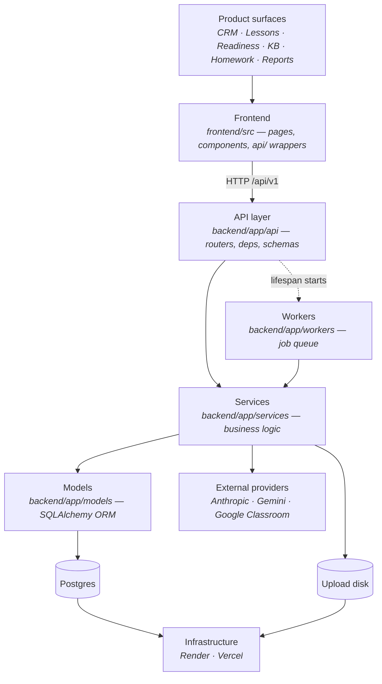

# Ownership

> **Governance layer.** Who is accountable for each subsystem and each document, and the
> dependency map that shows what depends on what.
>
> **Status:** Active · Part of Engineering Constitution v1.2

## Purpose

Every subsystem has an owner whether or not anyone wrote it down. Writing it down is what
lets the answer change without anything being dropped.

Today ownership is concentrated in one person — the Founder. **That is a fact to record,
not a problem to hide.** The structure exists so that when a second engineer arrives,
handing over a subsystem is editing a table rather than reconstructing tacit knowledge.

## The three kinds of owner

| Role | Answers the question |
|---|---|
| **Engineering owner** | Is the code correct, maintainable, and does it match its document? |
| **Product owner** | Should it behave this way? Is this the right thing to build? |
| **Operational owner** | Who is called when it breaks in production, and who restores it? |

One person can hold all three. They are separated because they are the first things to
diverge as a team grows, and because they fail differently: an absent engineering owner
produces rot, an absent product owner produces drift, an absent operational owner produces
outages nobody is fixing.

## Subsystem ownership

| Subsystem | Code | Engineering | Product | Operational |
|---|---|---|---|---|
| Auth & sessions | `security.py`, `api/auth.py`, `api/deps.py` | Founder | Founder | Founder |
| Multi-tenancy | `models/orgs.py`, org scoping across services | Founder | Founder | Founder |
| Student CRM | `services/student_crm.py`, `models/crm.py`, `api/students.py` | Founder | Founder | Founder |
| Lessons | `api/lessons.py`, `models/lessons.py` | Founder | Founder | Founder |
| Homework pipeline | `api/{assignments,classifieds,submissions}.py`, `services/{extraction,marking}.py` | Founder | Founder | Founder |
| Past papers | `api/past_papers.py`, `models/readiness_v2.py` | Founder | Founder | Founder |
| Readiness v1 | `services/readiness.py`, `services/readiness_summary.py` | Founder | Founder | Founder |
| Readiness v2 | `services/readiness_factors.py`, `readiness_v2.py`, `readiness_v2_ai.py`, `readiness_summary_v2.py` | Founder | Founder | Founder |
| Knowledge Base | `services/knowledge.py`, `api/knowledge.py` | Founder | Founder | Founder |
| AI platform | `services/ai.py`, `services/prompts.py` | Founder | Founder | Founder |
| AI metering & cost | `models/ai_usage.py`, `api/ai_usage.py` | Founder | Founder | Founder |
| Reports | `services/reports.py`, `api/reports.py` | Founder | Founder | Founder |
| Tutor chat | `api/chat.py`, `services/tutor_chat.py` | Founder | Founder | Founder |
| Google Classroom | `services/google_classroom.py`, `api/classroom.py` | Founder | Founder | Founder |
| Background jobs | `workers/jobs.py`, handler registration in `main.py` | Founder | Founder | Founder |
| File storage | `services/storage.py` | Founder | Founder | Founder |
| Frontend shell & routing | `App.tsx`, `AppShell.tsx`, `ProtectedRoute.tsx` | Founder | Founder | Founder |
| Design system | `frontend/src/index.css`, `components/ui.tsx` | Founder | Founder | Founder |
| API client | `frontend/src/api/client.ts` | Founder | Founder | Founder |
| Database & migrations | `models/`, `alembic/versions/` | Founder | Founder | Founder |
| Deployment | `render.yaml`, `Dockerfile`, `vercel.json` | Founder | Founder | Founder |

## Document ownership

Each numbered document has an owner responsible for keeping its **Current Reality** section
true and for approving Important and Recommended rules within it. The architecture owner
approves Critical rules and all principle changes.

| Document | Owner | Document | Owner |
|---|---|---|---|
| §01 Product Architecture | Founder | §08 Infrastructure & Deployment | Founder |
| §02 UX & Accessibility | Founder | §09 AI Platform | Founder |
| §03 Frontend Engineering | Founder | §10 Performance Engineering | Founder |
| §04 Backend Engineering | Founder | §11 Reliability (SRE) | Founder |
| §05 API Standards | Founder | §12 Quality Engineering | Founder |
| §06 Database Design | Founder | §13 Coding Standards | Founder |
| §07 Security Architecture | Founder | §14 Operations Runbooks | Founder |

**Architecture owner:** Founder. Approves ADRs, Critical rules, principle changes, and
non-goal reversals.

## Dependency map

The layering, top to bottom. **Dependencies point downward only.** A lower layer never
imports from a higher one — that is the rule the whole structure rests on.

### Runtime dependencies between subsystems

Beyond the layering, these are the couplings that matter when something breaks. The left
column is what fails; the right is what stops working with it.

| If this fails | These degrade |
|---|---|
| **Postgres** | Everything. No graceful degradation exists. |
| **Upload disk** | New uploads; existing file downloads; extraction and marking of anything not yet read. |
| **The in-process worker** | All extraction, marking, readiness synthesis, report generation, and Classroom sync. The loop is supervised and `/health/ready` reports its state, so the failure is now **findable** — but nothing alerts, so it stays silent until someone looks. |
| **Anthropic** | Chat, reports, readiness synthesis, class briefs. Marking and extraction survive (Gemini). |
| **Gemini** | Marking, question extraction, syllabus extraction — the homework pipeline. Chat and reports survive (Anthropic). |
| **Google Classroom** | Import only. Direct upload is unaffected by design. |
| **Readiness v2 (Layer 2)** | Readiness falls back per-subject to v1 and says `engine: "v1"`. |
| **Vercel** | The entire user-facing app. The API is unaffected but nobody can reach it. |

Two of these are worth reading twice. **A dead worker is invisible** — see `REL` gaps in
§11. And **the AI providers are deliberately split across surfaces**, so no single provider
outage stops the product; that is a design property to preserve, not a coincidence.

### Coupling rules

**`GOV-7` — MUST NOT · Critical · Active**
A lower layer may not import from a higher one. `models/` imports nothing from `services/`;
`services/` imports nothing from `api/`.
*Rationale:* the layering is the only thing preventing this codebase from becoming a graph,
and it is enforced by convention alone — nothing checks it.

**`GOV-8` — MUST · Important · Active**
A new external dependency is added to the dependency map and the failure table above, with
its degradation behaviour stated, in the same pull request.
*Rationale:* an undocumented dependency is discovered during an incident.

**`GOV-9` — SHOULD · Important · Active**
Prefer adding capability to an existing subsystem over creating a new one. A new subsystem
needs an owner, a document section, and an entry in these tables.
*Rationale:* ownership that is not assigned is ownership that does not exist.

## Handing over ownership

When a subsystem changes hands:

1. Update the row in this document.
2. The outgoing owner confirms the relevant document's Current Reality section is true, and
   its Known Gaps are current. **This is the actual handover** — everything else is a name
   in a table.
3. Walk the incoming owner through the subsystem's runbooks in §14, and the risks it owns
   in `governance/risk-register.md`.
4. The incoming owner opens the first pull request touching it.

## Known gaps

| Gap | Why it matters | Severity |
|---|---|---|
| **Every role is held by one person.** No redundancy for any subsystem, document, or operational duty. | A single point of failure for the entire system, including the knowledge required to operate it. This constitution is the mitigation in progress. | `blocking` |
| **No on-call rotation or escalation path.** | Nothing defines who responds out of hours or what happens if they do not. See §11. | `before scale` |
| **Layer coupling is enforced by convention only.** Nothing checks that `services/` does not import `api/`. | `GOV-7` is unenforceable until an import linter exists — see §13's toolchain gap. | `before scale` |

## Review triggers

- A person joins, leaves, or changes responsibility.
- A subsystem is added, removed, or split.
- A new external runtime dependency is introduced.
- A document changes owner.
- The layering changes.
