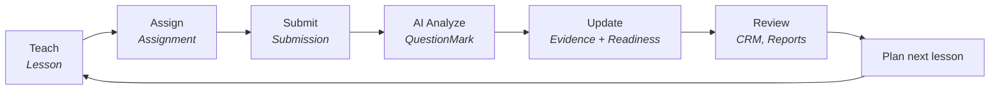
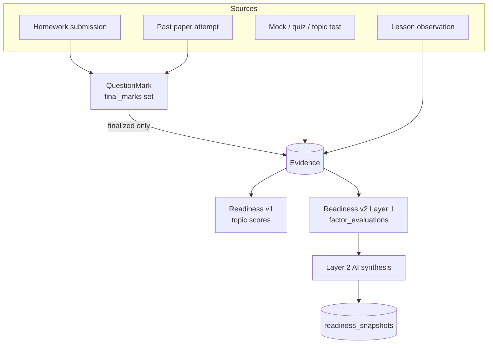

# 01. Product Architecture

> **Volume 1 — Product & UX** · Engineering Constitution v1.2 · Status: Active
> **Owner:** Founder (see `governance/ownership.md`)
>
> Governs the system map: what Avora is, the loop it runs, who sees what, and how a mark on
> a page becomes a readiness score.

## Contents

- [Purpose](#purpose)
- [Scope](#scope)
- [Sources](#sources)
- [Principles](#principles)
- [Current Reality](#current-reality)
- [Standards](#standards)
- [Known Gaps](#known-gaps)
- [Review Triggers](#review-triggers)

---

## Purpose

This document answers *what is this system, and how do its parts relate*. It is the map every
other document assumes you have read.

It defines the product's six surfaces, the operating loop that connects them, the role and
tenancy model that determines who sees what, and the evidence pipeline that turns academic
work into the readiness score at the product's centre. Where the codebase currently contains
two implementations of that centre, it says so.

## Scope

**In scope:** product surfaces and their code locations; the operating loop; roles and
visibility; the tenancy model; the evidence-to-readiness pipeline; the classified/past-paper
distinction; ingestion paths; the map from AI systems to product surfaces.

**Out of scope, covered elsewhere:** interface and accessibility rules (§02); how to
implement any of it (§03, §04); the API contract (§05); schema detail (§06); the AI platform
beneath the AI surfaces (§09); target-state design not yet built (`docs/avora-architecture.md`).

### Non-goals

Global non-goals are in `governance/non-goals.md`. Specific to product architecture:

- **Avora is not an AI tutor and not a homework marker.** The platform is the product; AI
  enhances every layer. A feature that is impressive AI but strengthens none of the six
  surfaces is not a Avora feature.
- **No model is asked to produce a grade.** A grade is a claim about an examination board's
  boundaries, not a judgement.
- **No AI adjudicates a dispute about AI output.** A remark request always routes to a human.
- **No third readiness engine.** There are already two, and retiring one is outstanding work.
- **No manual syllabus-coverage tracking.** Coverage is derived from what lessons recorded as
  taught. A feature asking a tutor to tick topics off duplicates evidence that already exists.

## Sources

Written from: `docs/avora-architecture.md`; `backend/app/main.py`; `backend/app/models/`
(all modules); `backend/app/services/evidence.py`, `readiness.py`, `readiness_summary_v2.py`,
`student_crm.py`, `grades.py`; `backend/app/api/past_papers.py`; `frontend/src/App.tsx`.

---

## Principles

**P1 — The platform is the product.** Student CRM, Lessons, Readiness, Knowledge Base,
Homework and Reports are the product; AI enhances every layer.

**P2 — Every number must be able to explain itself.** No metric exists unless Avora can say
where it came from. Every value is manual, imported, or calculated — and traceable to the
rows that produced it. This constraint shapes the whole schema, and it is why
`factor_evaluations` is an append-only row per factor per run rather than a JSON blob.

**P3 — Absence of data is a fact, not a zero.** A topic with no evidence reads "not enough
data yet". A factor with no evidence reports "no data" and is omitted from the weighted
average. Rendering either as `0` invents a failing student out of an empty database.

**P4 — The tutor has final authority over everything the AI produces.** Every AI output is a
proposal until a tutor accepts it, or until an explicitly-defined trust rule accepts it on
the tutor's behalf. Overriding is always possible and always recorded.

**P5 — The loop is the architecture.** Teach → Assign → Submit → Analyze → Update → Review →
Plan. Every entity exists to move a student around that loop.

**P6 — Multi-tenant underneath, single-tutor on top.** The data model is organization-scoped
from the first tenancy migration. Going organization-level later must be a role and interface
change, never a schema migration. See `adr/0005-multi-tenant-schema-single-tutor-ux.md`.

---

## Current Reality

### The operating loop

Each arrow is a real state transition backed by real rows. A `Lesson` records what was
taught, and `lesson_topics` marks those topics **taught** for every student in the group as
of that date — the evidence-based root of Syllabus Coverage, with no manual coverage tracking
anywhere. An `Assignment` optionally hangs off the lesson that set it
(`assignments.lesson_id`). A `Submission` is the student's work. `QuestionMark` rows are the
per-question outcome. Finalized marks become `Evidence`. Evidence drives readiness. Readiness
drives what the tutor sees when planning the next lesson.

### The six surfaces

| Surface | What it is | Primary code |
|---|---|---|
| **Student CRM** | The student's complete, continuously-updating academic record | `services/student_crm.py`, `api/students.py`, `models/crm.py` |
| **Lessons** | The dated teaching event — notes, topics covered, per-student observations | `api/lessons.py`, `models/lessons.py` |
| **Readiness** | Exam-readiness scores, predicted grades, weak topics, revision plans | `services/readiness*.py`, `api/readiness*.py` |
| **Knowledge Base** | Tutor-specific knowledge injected into every AI surface | `services/knowledge.py`, `api/knowledge.py` |
| **Homework** | Booklet → questions → submission → marking → review → evidence | `api/{assignments,submissions,classifieds}.py`, `services/{marking,extraction}.py` |
| **Reports** | Audience-specific narrative generated strictly from the student's data | `services/reports.py`, `api/reports.py` |

**The CRM aggregation is one function with two consumers.** `services/student_crm.py` feeds
both `GET /api/v1/students/{id}/crm` and `services/student_context.py` (AI grounding), so the
AI and the interface see the same record by construction.

The Knowledge Base follows the same pattern: `build_tutor_context()` compiles a tutor's
entries into one prompt block injected into marking, extraction, report generation and chat.

### Roles and visibility

Four roles, defined by `UserRole` in `backend/app/models/users.py`:

| Role | Sees | Notably cannot |
|---|---|---|
| `student` | Own readiness, own homework and past papers, own exam results, group files and recordings, AI chat | See other students; generate reports; download a past paper's mark scheme |
| `tutor` | Everything in their organization | Reach another organization's data |
| `parent` | Plain-language progress for linked children only | See anything not linked via a single-use `ParentLink` |
| `admin` | Tutor surfaces, plus report generation | — |

Two visibility rules are subtler than they look, and both have caused real bugs:

- **Past-paper visibility is scoped to (organization, subject), never subject alone.**
  Subjects are **global** — every organization shares the five built-in syllabuses — so
  matching on subject alone shows a student every past paper every tutor anywhere uploaded.
  `_enrolled_scope` in `api/past_papers.py` derives the pair from the groups the student is
  actually in, not from `user.organization_id`, so a student who joined a second tutor's
  group by invite sees that tutor's papers and only that tutor's.
- **A past paper's booklet is student-readable; its official mark scheme is tutor-only.**

### Tenancy

An `Organization` is auto-created per tutor at signup. Students and parents inherit the
organization of the tutor who created them. Every top-level aggregate carries
`organization_id`; child rows scope through their parent.

`api/deps.py` provides `get_current_org_id()` and `CurrentOrg` for scoping — **and neither is
called anywhere.** Scoping is applied ad hoc per query using `user.organization_id`. The
tenancy design is sound; the mechanism intended to make it safe was never adopted.

Note the asymmetry, because it is easy to read one as the other. The *role* half of `RISK-7`
is closed: a gate is now a dependency in the handler signature (`TutorUser`, `StudentUser`),
and `tests/test_authorization.py` fails if a route drops it. The *tenancy* half is not. An
organization filter is still a line in a query that a new query can omit, with nothing to
notice. See `RISK-7` and the gaps below.

### The evidence pipeline

`services/evidence.py` is the only writer of `Evidence`, and its docstring states the rule the
engine depends on: **only finalized homework and entered assessment/observation data become
evidence — nothing provisional, like an AI draft, ever influences readiness.**

`build_homework_evidence()` aggregates a settled submission's marks per topic and writes one
row per topic tagged `source_ref = f"submission:{id}"`, deleting prior rows for that
`source_ref` first — which is what makes it idempotent on re-finalization. It handles homework
and past papers through one code path because both are `Submission` + `QuestionMark` rows
(`adr/0004-polymorphic-submissions.md`).

Evidence is weighted by source. From `readiness.SOURCE_WEIGHTS`:

| Source | Weight | Why |
|---|---|---|
| `past_paper` | 1.8 | A full paper under exam conditions is the strongest signal there is |
| `mock` | 1.5 | Supervised and whole-paper, but not the real format |
| `homework` | 1.0 | The baseline |
| `quiz` | 0.8 | Narrow and short |
| `observation` | 0.5 | A tutor's judgement — valuable, but subjective |
| `tutor_estimate` | 0.4 | A tutor's starting estimate at cold start. Self-declared (`PROD-8`), and the only source that also loses weight *against rival evidence* — see below |

On top of source weight, every point decays exponentially with a **45-day half-life**
(`HALF_LIFE_DAYS`). `tutor_estimate` carries a second, independent attenuation: its weight
is divided by one more than the number of *marked* points on the same topic, so a tutor's
cold-start estimate is the whole answer while it is the only thing there and is
arithmetically irrelevant by the time a term's work sits behind it. Time decay alone would
not achieve this — the half-life discounts a seed and a real mark equally, so a quiet topic
would carry a first impression at full relative weight indefinitely (spec §7.3). The seed
row is never deleted: it is the record of what the score was built from (`PROD-1`). Confidence is a separate axis, growing with the amount of recent
decay-weighted evidence: `high` requires at least 3 recent points and an effective weight of
2.5. A topic with no points is `ReadinessConfidence.none` and displays as "not enough data
yet" — **P3** enforced in the engine, not the interface.

The scoring functions are **pure**: `compute_topic`, `subject_readiness` and `_confidence`
take frozen dataclasses and touch no database, so they unit-test without one.
`recompute_student()` is the database-facing entry point, run from the job worker.

### Readiness: two engines, one API

The most important thing to understand about the current codebase, and where the design
documents and reality diverge most. **Both engines exist and both run.**

- **v1** — `services/readiness.py`, writing `topic_readiness` and `readiness_history`,
  configured by `tutor_preferences`. Deterministic, no AI.
- **v2** — Layer 1 (`readiness_factors.py` pure math + `readiness_v2.py` database gathering)
  computes seven tutor-weighted factor sub-scores as append-only `factor_evaluations` rows.
  Layer 2 (`readiness_v2_ai.py`, job `compute_readiness_v2`) synthesizes those plus the
  organization's `readiness_weights` into a `readiness_snapshots` row.

The seven factors: Topic Mastery, Past Paper Performance, Homework Performance, Assessment
Performance, Syllabus Coverage, Mistake Analysis, Consistency.

**What the API serves:** `services/readiness_summary_v2.py` backs `GET /readiness/me`,
`/readiness/students/{id}` and `/readiness/students/{id}/trend`. Per subject it takes the
latest **ready** snapshot — score, predicted grade, weak topics, rationale, revision plan —
and that run's `topic_mastery` factor rows give the topic bars. Where a (student, subject) has
no ready snapshot, it falls back per-subject to v1's `build_summary` and the response says
`engine: "v1"`, so the app never shows a blank page mid-migration.

**What is still on v1:** `api/analytics.py`, `services/reports.py` and
`services/student_crm.py` read v1 tables directly. Repointing them and dropping
`topic_readiness` / `readiness_history` / `tutor_preferences` has not happened.

Three details that are easy to get wrong:

- **The predicted grade is never invented by the AI.** The model returns a score, weak topics
  and prose; `predict_grade()` in `services/grades.py` maps score to grade through ordered
  boundaries. Boundaries are tutor-entered per subject, because 70% can legitimately be an
  A*/9 in one subject and not another.
- **A failed run keeps its evidence.** If the Layer 2 call fails, the already-written
  `factor_evaluations` rows are kept and the snapshot is written with `status="failed"`.
- **`is_updating` comes from the `jobs` table, not the snapshot.** A `ReadinessSnapshot` row
  exists only once a run *finishes*, so there is no in-progress row to read. A pending or
  running `compute_readiness_v2` for that (student, subject) sets the flag, and the interface
  says "updating" over the last known score rather than implying it is current.

`READINESS_V2_SHADOW_ENABLED` (default **true**) is a **kill switch**, not a shadow flag,
despite its name. Turning it off stops v2 runs being enqueued and silently carries the whole
app on v1.

Weights are tutor-editable per organization at `GET`/`PUT /readiness/weights`; saving
recomputes every student that tutor teaches, debounced.

### Classifieds are not past papers

A **classified** is a topic-organized compilation of past-paper questions, with structures
that vary by tutor. It is the main practice source for most of the academic year and feeds
Topic Mastery and Homework Performance.

A **full past paper** is the whole paper, sat under conditions, and feeds Past Paper
Performance *and* Topic Mastery. Full papers start later in the year, so early in the year
readiness legitimately runs on classifieds and the Past Paper factor honestly reports "no
data" — which, per **P3**, is omitted rather than scored zero.

Two consequences:

- **A past paper reuses the entire homework pipeline.** Marking, auto-finalize, the review
  queue, the override audit, remark requests and evidence-building all apply with no
  past-paper-specific code.
- **Students self-log their own attempt** — `attempted_at`, a `timed` checkbox and
  `time_taken_minutes` are all self-declared, because the platform cannot observe them.
  `PastPaperAttempt` is the finalized roll-up the Past Paper factor reads, and its `max_marks`
  is the paper's own total, so skipping questions lowers the score rather than shrinking the
  denominator.

### How work gets into the system

1. **Direct upload.** A tutor uploads a booklet (and optionally a mark scheme); an
   `extract_assignment` job pulls the question list; the tutor publishes; a student uploads
   photos or a PDF.
2. **Google Classroom.** Per-tutor OAuth links a `Group` to one Classroom course. A
   `sync_classroom` job imports courseWork as draft `Assignment`s and turned-in submissions
   into the standard `mark_submission` pipeline. PDF and image attachments only — other Drive
   types are skipped, not guessed. Submissions match Classroom's roster email to a Avora
   account; unmatched students are skipped, not guessed.

**Classroom reduces friction; it never replaces direct upload.** Both feed the same pipeline,
and the feature degrades to a clear "not configured" state without its credentials.

### The AI suite, mapped to surfaces

| AI system | Where it lives | Product surface |
|---|---|---|
| Homework Analyzer | `services/marking.py`, `services/extraction.py` | Homework |
| Learning Assistant | `services/tutor_chat.py` | Student chat |
| Readiness Engine | `compute_readiness_v2` job (Layer 2) | Readiness |
| Report Generator | `services/reports.py` | Reports |
| Syllabus Extractor | `services/syllabus_extraction.py` | Subjects |
| Class Brief | `api/groups.py` → `class_brief` surface | Lessons |

Every one is grounded: marking and extraction get the tutor's Knowledge Base, chat and reports
get the student's CRM context, and readiness synthesis gets deterministic factor sub-scores it
is not allowed to contradict. See §09.

---

## Standards

**`PROD-1` — MUST · Critical · Active**
Every metric Avora displays is traceable to the rows that produced it. A new metric ships
with the query or job that computes it and a way for a tutor to see its inputs.
*Rationale:* an unexplainable number cannot be corrected or disputed, so it cannot be trusted
— and explainability is the product's differentiator, not a feature of it.

**`PROD-2` — MUST NOT · Critical · Active**
No surface may render a missing measurement as `0`, as `0%`, or as an empty progress bar that
reads as zero. Absent data is displayed as absent.
*Rationale:* a fabricated zero tells a student they failed something they never attempted.

**`PROD-3` — MUST · Critical · Active**
Every new top-level aggregate carries `organization_id`. Child rows scope through their
parent.
*Rationale:* a table without it turns "go organization-level later" back into the expensive
migration `ADR-0005` was written to avoid.

**`PROD-4` — MUST · Critical · Active**
Any query returning tenant data filters by organization. Never rely on a path or body
parameter alone to scope a request.
*Rationale:* subjects are global and IDs are enumerable, so an unscoped query is a
cross-tenant data leak, not a bug — see the past-paper visibility case above.

**`PROD-5` — MUST · Critical · Active**
Only finalized outcomes become `Evidence`. Provisional AI output, unfinalized marks and
drafts never influence readiness.
*Rationale:* readiness is shown to parents; a score moved by a draft the tutor later rejected
is indefensible.

**`PROD-6` — MUST NOT · Critical · Active**
No model is asked to produce a grade. Grades are computed by `predict_grade()` from a score
and the subject's ordered boundaries.
*Rationale:* a grade is a claim about an examination board's published boundaries, not a
judgement, and boundaries vary by subject in ways a model cannot know.

**`PROD-7` — MUST · Critical · Active**
A tutor can override any AI-produced value, and the override is recorded in an append-only
audit row with no API to edit or delete it.
*Rationale:* §01 P4. An override history that can be edited is not an audit trail.

**`PROD-8` — MUST · Important · Active**
Data the platform cannot observe — self-declared timing, self-reported conditions — is
labelled as self-declared everywhere it is shown.
*Rationale:* a self-reported "timed" attempt presented as observed misrepresents the strongest
evidence source in the engine.

**`PROD-9` — MUST NOT · Important · Active**
Do not add a parallel code path for past papers. They are `Submission` + `QuestionMark` rows
and go through the homework pipeline.
*Rationale:* duplicating auto-finalize, the override audit and remark handling means a fix
applied to one copy and not the other silently changes marks — see `ADR-0004`.

**`PROD-10` — MUST · Important · Active**
A new evidence source is added to `EvidenceSource` **and** given a weight in
`readiness.SOURCE_WEIGHTS` in the same change.
*Rationale:* an unweighted source raises `KeyError` or silently scores as absent, depending on
the path — neither is discoverable.

**`PROD-11` — MUST · Important · Active**
An AI surface that reads a student's record reads it through `services/student_crm.py`, not
through its own query.
*Rationale:* one aggregation with two consumers is what guarantees the AI and the interface
cannot be grounded in different truths.

**`PROD-12` — SHOULD · Recommended · Active**
Place every new feature on the operating loop in **P5**, and say which of the six surfaces it
strengthens.
*Rationale:* a feature that fits nowhere on the loop deserves a deliberate decision rather
than an accident.

**`PROD-13` — MUST NOT · Important · Active**
Do not add a third readiness engine, and do not add a second source of truth for a metric that
already has one.
*Rationale:* two engines already disagree in places (`RISK-5`); a third would make the
discrepancy undiagnosable.

**`PROD-14` — MUST · Important · Active**
Syllabus coverage is derived from `lesson_topics`. Do not add a manual mechanism for a tutor
to mark a topic covered.
*Rationale:* two sources for the same fact will disagree, and the derived one is the one with
a date and a lesson behind it.

---

## Known Gaps

| Gap | Why it matters | Severity |
|---|---|---|
| **v1 readiness is not retired.** `analytics.py`, `reports.py` and `student_crm.py` still read `topic_readiness` / `readiness_history` / `tutor_preferences` directly while `/readiness/*` serves v2. | A tutor can see one readiness number on the dashboard and a different one in a report for the same student. Largest open architectural debt in the product. See `RISK-5`. | `blocking` |
| **`CurrentOrg` and `get_current_org_id()` are dead code.** Org scoping is applied ad hoc per query. | `PROD-4` is enforced by memory in every query rather than by a dependency at the signature. The role gate was converged onto a dependency and tested; tenancy scoping was not, so this is what remains of `RISK-7`. See §04, §07. | `before scale` |
| **No `factor_evaluations` retention policy.** Append-only, one row per factor per run. | Unbounded growth. Named as needed in two prior documents and never written; §06 now sets the policy. | `before scale` |
| **Difficulty and topic proposals are not wired into the extraction review interface.** The AI assigns `assignment_questions.difficulty` with tutor override by design; the review screen does not surface it. | Topic Mastery buckets by difficulty, so an unreviewed AI guess silently shapes the score — a `PROD-1` traceability weakness. | `before scale` |
| **`READINESS_V2_SHADOW_ENABLED` is misnamed.** It has been a kill switch since the cutover. | Someone will disable it believing it merely stops a duplicate computation, and silently move the product back to v1. | `nice to have` |
| **Google Classroom has no configured credentials in any environment.** Built and tested against mocked calls only. | The integration is untested against the real API surface. Connecting it is a config step, not a code gap. | `nice to have` |
| **Classroom sync is on-demand only.** `POST /classroom/sync` is the only trigger. | Imported work reaches readiness late or not at all. The job type would work unchanged on a schedule. | `nice to have` |

---

## Review Triggers

Update this document when:

- A product surface is added, removed, or renamed.
- A role is added, or a role's visibility changes.
- `EvidenceSource`, `SOURCE_WEIGHTS`, or `HALF_LIFE_DAYS` changes.
- The readiness v1 → v2 cutover advances — especially when `analytics.py`, `reports.py` or
  `student_crm.py` stop reading v1 tables.
- A new ingestion path is added alongside direct upload and Classroom.
- The seven readiness factors change in number, name, or meaning.
- Tenancy stops being one organization per tutor.
- Any `ADR` listed in Sources is superseded.
