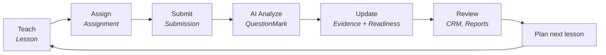
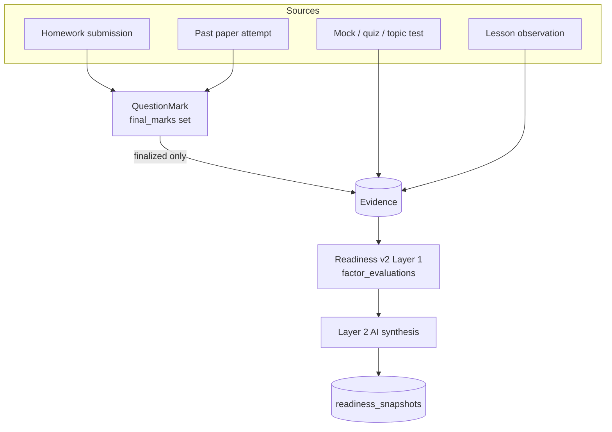

# 01. Product Architecture

> **Volume 1 — Product & UX** · Engineering Constitution v1.2 · Status: Active
> **Owner:** Founder (see `governance/ownership.md`)
>
> Governs the system map: what Avora is, the loop it runs, who sees what, and how a mark on
> a page becomes a readiness score.

## Contents

- [Purpose](#purpose)
- [Scope](#scope)
- [Sources](#sources)
- [Principles](#principles)
- [Current Reality](#current-reality)
- [Standards](#standards)
- [Known Gaps](#known-gaps)
- [Review Triggers](#review-triggers)

---

## Purpose

This document answers *what is this system, and how do its parts relate*. It is the map every
other document assumes you have read.

It defines the product's six surfaces, the operating loop that connects them, the role and
tenancy model that determines who sees what, and the evidence pipeline that turns academic
work into the readiness score at the product's centre. Where the codebase currently contains
two implementations of that centre, it says so.

## Scope

**In scope:** product surfaces and their code locations; the operating loop; roles and
visibility; the tenancy model; the evidence-to-readiness pipeline; the classified/past-paper
distinction; ingestion paths; the map from AI systems to product surfaces.

**Out of scope, covered elsewhere:** interface and accessibility rules (§02); how to
implement any of it (§03, §04); the API contract (§05); schema detail (§06); the AI platform
beneath the AI surfaces (§09); target-state design not yet built (`docs/avora-architecture.md`).

### Non-goals

Global non-goals are in `governance/non-goals.md`. Specific to product architecture:

- **Avora is not an AI tutor and not a homework marker.** The platform is the product; AI
  enhances every layer. A feature that is impressive AI but strengthens none of the six
  surfaces is not an Avora feature.
- **No model is asked to produce a grade.** A grade is a claim about an examination board's
  boundaries, not a judgement.
- **No AI adjudicates a dispute about AI output.** A remark request always routes to a human.
- **No third readiness engine.** There are already two, and retiring one is outstanding work.
- **No manual syllabus-coverage tracking.** Coverage is derived from what lessons recorded as
  taught. A feature asking a tutor to tick topics off duplicates evidence that already exists.

## Sources

Written from: `docs/avora-architecture.md`; `backend/app/main.py`; `backend/app/models/`
(all modules); `backend/app/services/evidence.py`, `readiness.py`, `readiness_summary_v2.py`,
`student_crm.py`, `grades.py`; `backend/app/api/past_papers.py`; `frontend/src/App.tsx`.

---

## Principles

**P1 — The platform is the product.** Student CRM, Lessons, Readiness, Knowledge Base,
Homework and Reports are the product; AI enhances every layer.

**P2 — Every number must be able to explain itself.** No metric exists unless Avora can say
where it came from. Every value is manual, imported, or calculated — and traceable to the
rows that produced it. This constraint shapes the whole schema, and it is why
`factor_evaluations` is an append-only row per factor per run rather than a JSON blob.

**P3 — Absence of data is a fact, not a zero.** A topic with no evidence reads "not enough
data yet". A factor with no evidence reports "no data" and is omitted from the weighted
average. Rendering either as `0` invents a failing student out of an empty database.

**P4 — The tutor has final authority over everything the AI produces.** Every AI output is a
proposal until a tutor accepts it, or until an explicitly-defined trust rule accepts it on
the tutor's behalf. Overriding is always possible and always recorded.

**P5 — The loop is the architecture.** Teach → Assign → Submit → Analyze → Update → Review →
Plan. Every entity exists to move a student around that loop.

**P6 — Multi-tenant underneath, single-tutor on top.** The data model is organization-scoped
from the first tenancy migration. Going organization-level later must be a role and interface
change, never a schema migration. See `adr/0005-multi-tenant-schema-single-tutor-ux.md`.

---

## Current Reality

### The operating loop

```mermaid
flowchart LR
  T[Teach<br/><i>Lesson</i>] --> A[Assign<br/><i>Assignment</i>]
  A --> S[Submit<br/><i>Submission</i>]
  S --> AI[AI Analyze<br/><i>QuestionMark</i>]
  AI --> U[Update<br/><i>Evidence + Readiness</i>]
  U --> R[Review<br/><i>CRM, Reports</i>]
  R --> P[Plan next lesson]
  P --> T
```

Each arrow is a real state transition backed by real rows. A `Lesson` records what was
taught, and `lesson_topics` marks those topics **taught** for every student in the group as
of that date — the evidence-based root of Syllabus Coverage, with no manual coverage tracking
anywhere. An `Assignment` optionally hangs off the lesson that set it
(`assignments.lesson_id`). A `Submission` is the student's work. `QuestionMark` rows are the
per-question outcome. Finalized marks become `Evidence`. Evidence drives readiness. Readiness
drives what the tutor sees when planning the next lesson.

### The six surfaces

| Surface | What it is | Primary code |
|---|---|---|
| **Student CRM** | The student's complete, continuously-updating academic record | `services/student_crm.py`, `api/students.py`, `models/crm.py` |
| **Lessons** | The dated teaching event — notes, topics covered, per-student observations | `api/lessons.py`, `models/lessons.py` |
| **Readiness** | Exam-readiness scores, predicted grades, weak topics, revision plans | `services/readiness*.py`, `api/readiness*.py` |
| **Knowledge Base (hidden)** | Tutor-specific knowledge injected into assignment extraction, marking, report generation and readiness synthesis (routes unmounted in 0.5/AV-58; not past-paper extraction, Syllabus Extractor, Class Brief, or narrative) | `services/knowledge.py`, `api/knowledge.py` (router hidden) |
| **Homework** | Booklet → questions → submission → marking → review → evidence | `api/{assignments,submissions,classifieds}.py`, `services/{marking,extraction}.py` |
| **Reports** | Audience-specific narrative generated strictly from the student's data | `services/reports.py`, `api/reports.py` |

**The CRM aggregation feeds `GET /api/v1/students/{id}/crm`.** `services/student_crm.py` also
fed `services/student_context.py` — AI grounding for the student chat surface, so the AI and
the interface saw the same record by construction — until task 0.3 deleted both the surface and
that grounding module (AV-57). No AI surface reads *that specific aggregation* today — the CRM
endpoint remains its only reader. (`services/reports.py`'s `build_report_facts()` is a separate
AI grounding path into a student's own record — readiness scores and topic breakdowns, queried
directly rather than through `student_crm.py` — for the `reports` surface's student-audience
output; it was never routed through `student_context.py` and 0.3 didn't touch it. This is a
pre-existing `PROD-11` violation, not one this change introduces — see Known Gaps.)

The Knowledge Base follows a related pattern: `build_tutor_context()` compiles a tutor's
entries into one prompt block injected into marking, extraction, report generation and
readiness synthesis.

### Roles and visibility

Four roles, defined by `UserRole` in `backend/app/models/users.py`:

| Role | Sees | Notably cannot |
|---|---|---|
| `student` | Own readiness, own homework and past papers, own exam results, group files and recordings | See other students; generate reports; download a past paper's mark scheme |
| `tutor` | Everything in their organization | Reach another organization's data |
| `parent` | Plain-language progress for linked children only | See anything not linked via a single-use `ParentLink` |
| `admin` | Tutor surfaces, plus report generation | — |

Two visibility rules are subtler than they look, and both have caused real bugs:

- **Past-paper visibility is scoped to (organization, subject), never subject alone.**
  Subjects are **global** — every organization shares the five built-in syllabuses — so
  matching on subject alone shows a student every past paper every tutor anywhere uploaded.
  `_enrolled_scope` in `api/past_papers.py` derives the pair from the groups the student is
  actually in, not from `user.organization_id`, so a student who joined a second tutor's
  group by invite sees that tutor's papers and only that tutor's.
- **A past paper's booklet is student-readable; its official mark scheme is tutor-only.**

### Tenancy

An `Organization` is auto-created per tutor at signup. Students and parents inherit the
organization of the tutor who created them. Every top-level aggregate carries
`organization_id`; child rows scope through their parent.

`api/deps.py` provides `get_current_org_id()` and `CurrentOrg` for scoping — **and neither is
called anywhere.** Scoping is applied ad hoc per query using `user.organization_id`. The
tenancy design is sound; the mechanism intended to make it safe was never adopted.

Note the asymmetry, because it is easy to read one as the other. The *role* half of `RISK-7`
is closed: a gate is now a dependency in the handler signature (`TutorUser`, `StudentUser`),
and `tests/test_authorization.py` fails if a route drops it. The *tenancy* half is not. An
organization filter is still a line in a query that a new query can omit, with nothing to
notice. See `RISK-7` and the gaps below.

### The evidence pipeline

```mermaid
flowchart TD
  subgraph Sources
    HW[Homework submission]
    PP[Past paper attempt]
    MOCK[Mock / quiz / topic test]
    OBS[Lesson observation]
  end
  HW --> QM[QuestionMark<br/>final_marks set]
  PP --> QM
  QM -->|finalized only| EV[(Evidence)]
  MOCK --> EV
  OBS --> EV
  EV --> R2[Readiness v2 Layer 1<br/>factor_evaluations]
  R2 --> AIS[Layer 2 AI synthesis]
  AIS --> SNAP[(readiness_snapshots)]
```

`services/evidence.py` is the only writer of `Evidence`, and its docstring states the rule the
engine depends on: **only finalized homework and entered assessment/observation data become
evidence — nothing provisional, like an AI draft, ever influences readiness.**

`build_homework_evidence()` aggregates a settled submission's marks per topic and writes one
row per topic tagged `source_ref = f"submission:{id}"`, deleting prior rows for that
`source_ref` first — which is what makes it idempotent on re-finalization. It handles homework
and past papers through one code path because both are `Submission` + `QuestionMark` rows
(`adr/0004-polymorphic-submissions.md`).

Evidence is not weighted by source any more. v1 did that (`readiness.SOURCE_WEIGHTS`, past
paper 1.8 down to tutor estimate 0.4); 5.3b deleted v1 with it. v2 weighs **factors**, not
sources (`readiness_weights`, below), and each factor reads its own inputs: Topic Mastery
reads marked questions (weighted by difficulty), Past Paper and Assessment Performance read
their own totals, and `evidence` rows feed Syllabus Coverage. Every input that decays
(Topic Mastery, Assessment Performance, Mistake Analysis) uses the **tutor's half-life** —
`readiness_weights.half_life_days`, resolved per subject like the weights, default 45
(`readiness_factors.HALF_LIFE_DAYS` is only the default). Until the Phase 5 sweep (#100) v2
ignored the setting and always used 45. Each decaying factor row records the half-life it was
scored with in `detail.half_life_days` (`PROD-1`).

**Reports** (`services/reports.py`) are written from the generating tutor's side: their
classes' subjects, their organization's custom criteria, their organization's AI cost. A
report is refused (409, shown in the panel) when the student is in no class for the subject
or has no score, marked work or homework to report on — the model is never called on an
empty facts block — and a re-run of a ready report does not call the model again (`BE-6`).
Staff read only reports their own organization generated.

**The class narrative** grounds on the same class aggregation as the brief
(`class_readiness` + `weak_topic_means`), with a flat query count, and states absence as
absence: scored / on-track / not-enough-data are separate counts, and missing boundaries or
thin topic data are said, never rendered as "0 on track" or "none flagged" (`PROD-2`).

`tutor_estimate` survives as a labelled prior inside Topic Mastery (decision 14,
`TUTOR_ESTIMATE_WEIGHT = 0.4`): its weight is divided by one more than the number of marked
questions on the topic, so a cold-start estimate is the whole answer while it is the only
thing there and arithmetically irrelevant once a term's work sits behind it. The seed row is
never deleted — it is the record of what the score was built from (`PROD-1`) — and the
topic's `detail` carries its share so every reader can say "includes tutor estimate"
(`PROD-8`).

Observations belong to the student profile, not readiness (`PROD-15`): they write no
evidence and queue no recompute. `observation` evidence rows written before the rule are kept
and excluded by `services/evidence.COUNTS_FOR_READINESS` wherever evidence is read.

### Readiness: one engine

Since 5.3b (AV-78) there is one engine. v1 (`services/readiness.py`, `topic_readiness`,
`readiness_history`, `tutor_preferences`) was deleted; migration `0055` dropped its tables.

- **Layer 1** (`readiness_factors.py` pure math + `readiness_v2.py` database gathering)
  computes six tutor-weighted factor sub-scores as append-only `factor_evaluations` rows.
- **Layer 2** (`readiness_v2_ai.py`, job `compute_readiness_v2`) synthesizes those plus the
  resolved readiness config into a `readiness_snapshots` row. The config is
  `services/readiness_config.resolve_readiness_config`: the subject's `readiness_weights`
  override if it has one, else the organization's account row, else built-in defaults — a
  subject row replaces the account row whole (task 5.4a, decision 8). A factor switched off
  is still computed and stored but omitted from what synthesis sees, never sent at weight 0.
  Synthesis runs only when the enabled factors give a usable weighted reference; with none
  (no scored factor, or every scored one at weight 0) the snapshot is "not enough data yet"
  and the model is never called (5.5). The weights API refuses a config whose switched-on
  factors all weigh 0. Syllabus Coverage with nothing taught is no data, not 0%.

The six factors: Topic Mastery, Past Paper Performance, Homework Performance, Assessment
Performance, Syllabus Coverage, Mistake Analysis. Homework Performance is accuracy over marked
work only; completion ("4 of 5 handed in") is a fact on the tutor's student profile
(`SubjectReadiness.homework_*_count`), never part of a score, and is filtered out of what the
synthesis model sees (AV-32). Consistency was retired in 5.1 (AV-30): the engine never writes it,
but `ReadinessFactor.consistency` stays so historical `factor_evaluations` rows still load.

### Custom criteria: beside readiness, never in it

Since task 5.4b (AV-35, decision 6) a tutor can define criteria of their own — "Exam
technique", "Confidence" — for the whole organization or one subject, and hand-score each
student 0–100 on them (`services/custom_criteria.py`, tables from `0058`).

- **Never in the score.** A criterion has no weight, and nothing in the engine or the
  synthesis prompt reads these tables: a tutor's number has no evidence behind it (`PROD-1`).
- **Unscored is absent** — `score: null`, never 0 (`PROD-2`). Every score carries
  `source: "tutor"` so each surface can label it tutor-entered (`PROD-8`, `UX-20`).
- **Every set, change and clear writes a `custom_criterion_score_audit` row** in the same
  transaction; no API edits or deletes one (`PROD-7`). Its ids are plain integers, not
  foreign keys, so the trail outlives a cleared score.
- **Scope:** a subject criterion applies only to students enrolled in that subject
  (`student_subjects`); scoring anyone else is a `409`, as is scoring an archived criterion.
  Criteria are archived, never deleted, and the subject is fixed at creation.
- **Who sees what (5.4c, decisions 18–19).** Tutors manage criteria (`/custom-criteria`,
  Settings) and set or clear scores on the student profile (`PUT/DELETE
  /students/{id}/custom-criteria/{criterion_id}`, `_tutor_student`). The read
  (`GET /students/{id}/custom-criteria`) goes through `_viewable_student`: the student sees
  their own, a linked parent their child's. One `CustomCriteriaPanel` renders all three.
- **Reports** get a fixed "Tutor-entered criteria" list appended *after* the AI text
  (`services/reports.criteria_section`); the model never reads it. Names are collapsed to
  one line on the way in so one cannot forge report Markdown.

**What the API serves:** `services/readiness_summary_v2.py` backs `GET /readiness/me`,
`/readiness/students/{id}` and `/readiness/students/{id}/trend`. Per subject it takes the
latest **ready** snapshot — score, predicted grade, rationale, revision plan — and that
run's `topic_mastery` factor rows give the topic bars and the **weak topics**. Since 5.6 a weak
topic is deterministic (decision 10): a Topic Mastery row with a score, above `no_data`, at or
below the tutor's `weak_threshold` (on `readiness_weights`, default 60, resolved like the
rest of the row), lowest five. It is derived at read time, so a threshold change shows at
once with no recompute (a threshold-only save enqueues nothing), and
`readiness_snapshots.weak_topics` — the AI's old picks — is kept but never read. The class
views filter class topic means by the same threshold (`class_readiness.weak_topic_means`).
`MASTERY_THRESHOLD` (75, mastered-for-coverage) is a separate line. A (student, subject) with no
ready snapshot is shown as "not enough data yet", never omitted and never 0 (`PROD-2`). Every
other reader — analytics, reports, the CRM, the home strip and the class page — reads the same
snapshots (`services/class_readiness.py` for the class aggregates).

Three details that are easy to get wrong:

- **The predicted grade is never invented by the AI.** The model returns a score and prose
  (no longer weak topics, since 5.6); `predict_grade()` in `services/grades.py` maps score to grade through ordered
  boundaries. Boundaries are tutor-entered per subject, because 70% can legitimately be an
  A*/9 in one subject and not another.
- **A failed run keeps its evidence.** If the Layer 2 call fails, the already-written
  `factor_evaluations` rows are kept and the snapshot is written with `status="failed"`.
- **`is_updating` comes from the `jobs` table, not the snapshot.** A `ReadinessSnapshot` row
  exists only once a run *finishes*, so there is no in-progress row to read. A pending or
  running `compute_readiness_v2` for that (student, subject) sets the flag, and the interface
  says "updating" over the last known score rather than implying it is current.

`READINESS_V2_SHADOW_ENABLED` (default **true**) is a **kill switch**, not a shadow flag,
despite its name. Turning it off stops v2 runs being enqueued; with v1 gone there is nothing
behind it, so every score freezes at its last snapshot.

Weights are tutor-editable per organization at `GET`/`PUT /readiness/weights`; saving
recomputes every student that tutor teaches, debounced.

### The teaching plan: AI advises, a scheduler decides

Phase 6 (tasks 6.1–6.8, PRs #104–#113) added a subsystem for what a tutor intends to teach a
class, and when. It is **tutor-only**: a plan and its exam date are never shown to students or
parents (AV-19). Tables and constraints are in §06; endpoints in §05; jobs and lock order in
§04; the AI surface in §09; the decision in `ADR-0011`.

**Lifecycle.** A class (not a subject — a class has exactly one subject, AV-72) has at most one
**draft** and one **accepted** plan.

1. **Inputs** — the tutor saves exam date, lessons per week, lesson length, an optional
   past-paper start date and breaks. They create or update the *draft*; an accepted plan's
   inputs are never edited in place.
2. **Draft** — the `draft_plan` job asks the model for a relative weight per chapter
   (`plan_weighting`), then a pure scheduler (`services/plan_scheduler.py`) lays lessons on the
   calendar. The model never sees or sets a date (E5). What the run did is recorded in
   `draft_result` — weights, reasons, whether the AI was used or degraded to stored chapter
   weights — so an even split is never passed off as advice (`PROD-1`, `PROD-2`). Changing the
   inputs or breaks afterwards marks the draft **stale**; a stale draft cannot be accepted.
3. **Accept** — only the tutor accepting makes a plan live. **Nothing reads a draft**: every
   reader goes through `accepted_plan_for_group`. Accepting replaces any previously accepted
   plan in one transaction and queues a readiness recompute for every student in the class.
4. **Edit** — the tutor can move a slot or change its chapter on either plan with no
   re-acceptance (AV-13); the tutor owns the calendar.

**E15: a slot is the plan, a lesson is what happened.** A `PlanSlot` is a *planned* lesson and
a `Lesson` the confirmed *actual* one; they are never the same row. A slot that gets taught
keeps its own row and records that in `provenance` and `lesson_id`, so the plan remains a record
of the intention after reality diverges. Creating a lesson from the plan's suggestion
(`GET /plan/next-lesson`, then `POST /lessons` with `plan_slot_id`) confirms the slot in the same
transaction; the plan only suggests, the tutor submits. `lesson_topics` stays the sole source of
syllabus coverage (`PROD-14`).

**AV-77: provenance decides what a machine may touch.** Slots are `generated`,
`manually_modified`, `confirmed` or `completed`. Only `generated` slots are ever moved by the
system; a tutor's own edit and any slot a lesson has claimed is theirs. Deleting a lesson frees
its slot as `manually_modified`, not `generated`, so a reflow cannot move something the tutor has
touched.

**Two ways the plan changes after acceptance, deliberately different** (`CODE-12`):

- **Reflow (6.8, AV-68, E13) is automatic.** Applying a syllabus edit (adding, splitting,
  reordering or removing chapters) queues a `reflow_plan` job per plan of every class on the
  subject. It re-lays only `generated` slots dated after today, with no acceptance step and no AI
  call — the tutor changed the chapters themselves, so there is nothing to confirm.
- **Re-plan (6.6, AV-18) waits for acceptance.** A class that is behind (accepted-plan lessons
  dated before today with no lesson recorded) can be re-planned in one click: this drafts a fresh
  plan from today beside the live one and nothing changes until the tutor accepts it. "Nothing
  reschedules itself" is the point. Recorded lessons keep their slot across the swap.

"Behind" is reported as **"not recorded"**, never "missed": a lesson may have been taught and
never logged, and the platform cannot tell those apart (`PROD-2`). The tutor home also shows a
`chapter_prompts` list — a class whose accepted plan has reached a chapter with no classified
yet — as information with a link, never a gate.

**The past-paper gate (5.7, AV-31).** Past Paper Performance counts only once the past-paper
phase has started: `past_paper_phase_started` in `services/readiness_factors.py`, read by
`readiness_v2.py`. The gate closes only when the student is in at least one class in that subject,
**every** such class has an accepted plan, and none of those plans has a past-paper start date on
or before today. **No accepted plan means no gate** — past papers count as they did before
plans existed (owner decision, 2026-10-03). A NULL start date means "not started", never
"started" (`DB-9`). Hiding a student's real evidence is the costly mistake, so the gate errs
open.

### Classifieds are not past papers

A **classified** is a topic-organized compilation of past-paper questions, with structures
that vary by tutor. It is the main practice source for most of the academic year and feeds
Topic Mastery and Homework Performance.

A **full past paper** is the whole paper, sat under conditions, and feeds Past Paper
Performance *and* Topic Mastery. Full papers start later in the year, so early in the year
readiness legitimately runs on classifieds and the Past Paper factor honestly reports "no
data" — which, per **P3**, is omitted rather than scored zero.

Two consequences:

- **A past paper reuses the entire homework pipeline.** Marking, auto-finalize, the review
  queue, the override audit, remark requests and evidence-building all apply with no
  past-paper-specific code.
- **Students self-log their own attempt** — `attempted_at`, a `timed` checkbox and
  `time_taken_minutes` are all self-declared, because the platform cannot observe them.
  `PastPaperAttempt` is the finalized roll-up the Past Paper factor reads, and its `max_marks`
  is the paper's own total, so skipping questions lowers the score rather than shrinking the
  denominator.

Two owner decisions (2026-10-02) shape the rest:

- **A past-paper mark reaches Topic Mastery through its question's topics.** Extraction
  classifies every question under the subject's syllabus topics (`past_paper_question_topics`),
  and Topic Mastery reads settled marks from homework and past papers alike
  (`TOPIC_MASTERY_KINDS` in `services/readiness_v2.py`). Before this a past-paper mark reached
  the Past Paper factor and the topic's evidence rows but never its mastery score. A question
  classified under no topic counts towards none, and the tutor's shelf lists each question's
  topics so that is visible (`PROD-1`). A past-paper question has no difficulty rating, so it
  weighs what a medium one does, and it ages from when its mark settled — never the
  self-declared `attempted_at` (`PROD-8`). **Mocks are not included**: whether their marks count
  is still the owner's to decide. Scores already computed keep the old answer until the R9
  backfill runs.
- **A paper the AI cannot read is the tutor's to fix.** It joins the tutor's to-do list
  (`GET /assignments/attention`, reason `extraction_failed`, `past_paper_id` set) for as long
  as its read has failed and it is on their shelf — a fix takes it off the list while the new
  read runs, and a read that fails again puts it back. The shelf offers two fixes on the same
  row, each refused while a read of the paper is already running:
  `POST /past-papers/{id}/retry-extraction` reads it again — bringing forward the automatic
  retry if one is already waiting, rather than paying for two reads — and
  `PUT /past-papers/{id}/paper` swaps in a clearer copy. Students keep the paper throughout.
  Answers sent while it is unreadable fail marking for want of questions, and are queued for
  marking again the moment its questions are read.

### How work gets into the system

1. **Direct upload.** A tutor uploads a booklet (and optionally a mark scheme); an
   `extract_assignment` job pulls the question list; the tutor publishes; a student uploads
   photos or a PDF.
2. **Google Classroom.** Per-tutor OAuth links a `Group` to one Classroom course. A
   `sync_classroom` job imports courseWork as draft `Assignment`s and turned-in submissions
   into the standard `mark_submission` pipeline. PDF and image attachments only — other Drive
   types are skipped, not guessed. Submissions match Classroom's roster email to an Avora
   account; unmatched students are skipped, not guessed.

**Classroom reduces friction; it never replaces direct upload.** Both feed the same pipeline,
and the feature degrades to a clear "not configured" state without its credentials.

### The AI suite, mapped to surfaces

| AI system | Where it lives | Product surface |
|---|---|---|
| Homework Analyzer | `services/marking.py`, `services/extraction.py` | Homework |
| Readiness Engine | `compute_readiness_v2` job (Layer 2) | Readiness |
| Report Generator | `services/reports.py` | Reports |
| Syllabus Extractor | `services/syllabus_extraction.py` | Subjects |
| Class Brief | `api/groups.py` → `class_brief` surface | Lessons |

Most are grounded: marking, assignment extraction, report generation and readiness synthesis
all get the tutor's Knowledge Base (`build_tutor_context()`), and readiness synthesis
additionally gets deterministic factor sub-scores it is not allowed to contradict. Past-paper
extraction (`_run_past_paper_extraction()`) does not — the assignment path built the KB
injection, and the past-paper path was never extended to match it. The Syllabus Extractor and
Class Brief do not either — the Syllabus Extractor works from the uploaded document alone, and
Class Brief from the class's own readiness analytics (weak topics, lowest-readiness learners),
with no Knowledge Base injection. (The deleted student chat surface was the one AI system
grounded in the student's own CRM record, via `services/student_context.py` — task
0.3, AV-57, removed both together; see above.) See §09.

---

## Standards

**`PROD-1` — MUST · Critical · Active**
Every metric Avora displays is traceable to the rows that produced it. A new metric ships
with the query or job that computes it and a way for a tutor to see its inputs.
*Rationale:* an unexplainable number cannot be corrected or disputed, so it cannot be trusted
— and explainability is the product's differentiator, not a feature of it.

**`PROD-2` — MUST NOT · Critical · Active**
No surface may render a missing measurement as `0`, as `0%`, or as an empty progress bar that
reads as zero. Absent data is displayed as absent.
*Rationale:* a fabricated zero tells a student they failed something they never attempted.

**`PROD-3` — MUST · Critical · Active**
Every new top-level aggregate carries `organization_id`. Child rows scope through their
parent.
*Rationale:* a table without it turns "go organization-level later" back into the expensive
migration `ADR-0005` was written to avoid.

**`PROD-4` — MUST · Critical · Active**
Any query returning tenant data filters by organization. Never rely on a path or body
parameter alone to scope a request.
*Rationale:* subjects are global and IDs are enumerable, so an unscoped query is a
cross-tenant data leak, not a bug — see the past-paper visibility case above.

**`PROD-5` — MUST · Critical · Active**
Only finalized outcomes become `Evidence`. Provisional AI output, unfinalized marks and
drafts never influence readiness.
*Rationale:* readiness is shown to parents; a score moved by a draft the tutor later rejected
is indefensible.

**`PROD-6` — MUST NOT · Critical · Active**
No model is asked to produce a grade. Grades are computed by `predict_grade()` from a score
and the subject's ordered boundaries.
*Rationale:* a grade is a claim about an examination board's published boundaries, not a
judgement, and boundaries vary by subject in ways a model cannot know.

**`PROD-7` — MUST · Critical · Active**
A tutor can override any AI-produced value, and the override is recorded in an append-only
audit row with no API to edit or delete it.
*Rationale:* §01 P4. An override history that can be edited is not an audit trail.

**`PROD-8` — MUST · Important · Active**
Data the platform cannot observe — self-declared timing, self-reported conditions — is
labelled as self-declared everywhere it is shown.
*Rationale:* a self-reported "timed" attempt presented as observed misrepresents the strongest
evidence source in the engine.

**`PROD-9` — MUST NOT · Important · Active**
Do not add a parallel code path for past papers. They are `Submission` + `QuestionMark` rows
and go through the homework pipeline.
*Rationale:* duplicating auto-finalize, the override audit and remark handling means a fix
applied to one copy and not the other silently changes marks — see `ADR-0004`.

**`~~PROD-10~~` — MUST · Important · Superseded by `PROD-15` (2026-09, task 5.3b deleted `SOURCE_WEIGHTS` with v1)**
A new evidence source is added to `EvidenceSource` **and** given a weight in
`readiness.SOURCE_WEIGHTS` in the same change.
*Rationale:* an unweighted source raises `KeyError` or silently scores as absent, depending on
the path — neither is discoverable.
*Superseded because* v2 weighs factors, not sources, and has no per-source table to keep in
step.

**`PROD-11` — MUST · Important · Active**
An AI surface that reads a student's record reads it through `services/student_crm.py`, not
through its own query.
*Rationale:* one aggregation with two consumers is what guarantees the AI and the interface
cannot be grounded in different truths.

**`PROD-12` — SHOULD · Recommended · Active**
Place every new feature on the operating loop in **P5**, and say which of the six surfaces it
strengthens.
*Rationale:* a feature that fits nowhere on the loop deserves a deliberate decision rather
than an accident.

**`PROD-13` — MUST NOT · Important · Active**
Do not add a third readiness engine, and do not add a second source of truth for a metric that
already has one.
*Rationale:* two engines already disagree in places (`RISK-5`); a third would make the
discrepancy undiagnosable.

**`PROD-14` — MUST · Important · Active** *(amended by owner decision, 2026-10-05)*
Syllabus coverage has exactly two sources: `lesson_topics`, and the per-class **taught before
Avora** marker (`taught_before_topics`, task 9.1b). A topic is covered for a class when either
holds it. Do not add a third, and do not add any other manual mechanism for a tutor to mark a
topic covered.
*Rationale:* two sources for the same fact will disagree, and the derived one is the one with
a date and a lesson behind it. The marker is the one exception because a tutor who joins
mid-year has taught topics no lesson in Avora records; without it coverage understates and the
teaching plan re-drafts chapters already taught. The owner chose a separate marker over a
"before Avora" lesson so that no invented lesson, date or attendance exists.
*Bounds on the exception:* the marker is answered once per class from the class's Syllabus tab
(`GET`/`PUT /groups/{id}/taught-before`) and is a whole-list replace; every coverage reader
unions it through `services/taught_before.py` rather than querying the table itself
(`readiness_v2._topic_coverage`, `class_report._chapter_reports`, `plan_drafting`).
*Known gap:* it is tutor-declared, and outside the editor a covered topic is not labelled as
declared rather than taught in a recorded lesson (`PROD-8`). `before scale`.

**`PROD-15` — MUST · Important · Active** *(owner decision, 2026-09-26)*
Readiness evidence is **marked work** — homework, past papers, mocks, entered assessments —
plus the labelled tutor estimate (`PROD-8`). A tutor observation belongs to the **student
profile** and never feeds readiness: not a factor score, not coverage. A new input that should
count toward readiness is read by a v2 factor in the same change it is added.
*Rationale:* an observation is the tutor's note about a student, not a measurement of exam
performance; letting it move a readiness number makes that number harder to explain
(`PROD-1`). And a source no factor reads is silently absent — the failure `PROD-10` guarded
against, in v2's shape.

---

## Known Gaps

| Gap | Why it matters | Severity |
|---|---|---|
| **`CurrentOrg` and `get_current_org_id()` are dead code.** Org scoping is applied ad hoc per query. | `PROD-4` is enforced by memory in every query rather than by a dependency at the signature. The role gate was converged onto a dependency and tested; tenancy scoping was not, so this is what remains of `RISK-7`. See §04, §07. | `before scale` |
| **No `factor_evaluations` retention policy.** Append-only, one row per factor per run. | Unbounded growth. Named as needed in two prior documents and never written; §06 now sets the policy. | `before scale` |
| **Difficulty and topic proposals are not wired into the extraction review interface.** The AI assigns `assignment_questions.difficulty` with tutor override by design; the review screen does not surface it. | Topic Mastery buckets by difficulty, so an unreviewed AI guess silently shapes the score — a `PROD-1` traceability weakness. | `before scale` |
| **`READINESS_V2_SHADOW_ENABLED` is misnamed.** It has been a kill switch since the cutover. | Someone will disable it believing it merely stops a duplicate computation, and silently freeze every readiness score. | `nice to have` |
| **Google Classroom has no configured credentials in any environment.** Built and tested against mocked calls only. | The integration is untested against the real API surface. Connecting it is a config step, not a code gap. | `nice to have` |
| **Classroom sync is on-demand only.** `POST /classroom/sync` is the only trigger. | Imported work reaches readiness late or not at all. The job type would work unchanged on a schedule. | `nice to have` |
| **`services/reports.py`'s `build_report_facts()`, `api/groups.py`'s `class_brief` handler, and `services/narrative.py`'s grounding builders all violate `PROD-11`.** Each queries readiness/topic/mistake data directly for its AI surface instead of going through `services/student_crm.py`. Pre-existing, not introduced by 0.3–0.5. | These surfaces and the CRM could in principle diverge on the same student's numbers, the exact failure `PROD-11` exists to prevent. | `before scale` |
| **Nothing recomputes readiness when a past-paper start date arrives.** The 5.7 gate is evaluated at recompute time, and a recompute is queued by evidence and by plan acceptance, not by the calendar. | A class whose past-paper phase begins today keeps its Past Paper Performance factor hidden until something else triggers a recompute. Open owner decision (recorded 2026-10-03); do not "fix" it without one. | `before scale` |
| **Behind-schedule lessons read "not recorded" until task 7.4.** The plan can say a planned lesson has no recorded lesson, not that it did or did not happen. | By design (`PROD-2`), but a tutor who teaches and does not log sees a class as behind. Task 7.4 is what narrows it. | `nice to have` |
| **The plan's Postgres row-lock behaviour is unverified by the suite.** Writers lock plan rows then slots (§04); `SELECT ... FOR UPDATE` is a no-op on SQLite, which runs every test. | The ordering rule that prevents deadlock and double-confirmed slots is by construction, backed by `UNIQUE(lesson_id)` and a conditional `UPDATE`, not exercised by a concurrent test. `RISK-3` shape. | `before scale` |
| **Past-paper extraction (`_run_past_paper_extraction()`) never got Knowledge Base injection.** Assignment extraction (`_run_extraction()`) does. | A tutor's marking-style instructions apply to assignment extraction but silently not to past papers — an inconsistency, not a correctness bug. | `nice to have` |

---

## Review Triggers

Update this document when:

- A product surface is added, removed, or renamed.
- A role is added, or a role's visibility changes.
- `EvidenceSource`, a factor's inputs, `TUTOR_ESTIMATE_WEIGHT` or `HALF_LIFE_DAYS` changes.
- A new ingestion path is added alongside direct upload and Classroom.
- The seven readiness factors change in number, name, or meaning.
- Tenancy stops being one organization per tutor.
- Any `ADR` listed in Sources is superseded.
