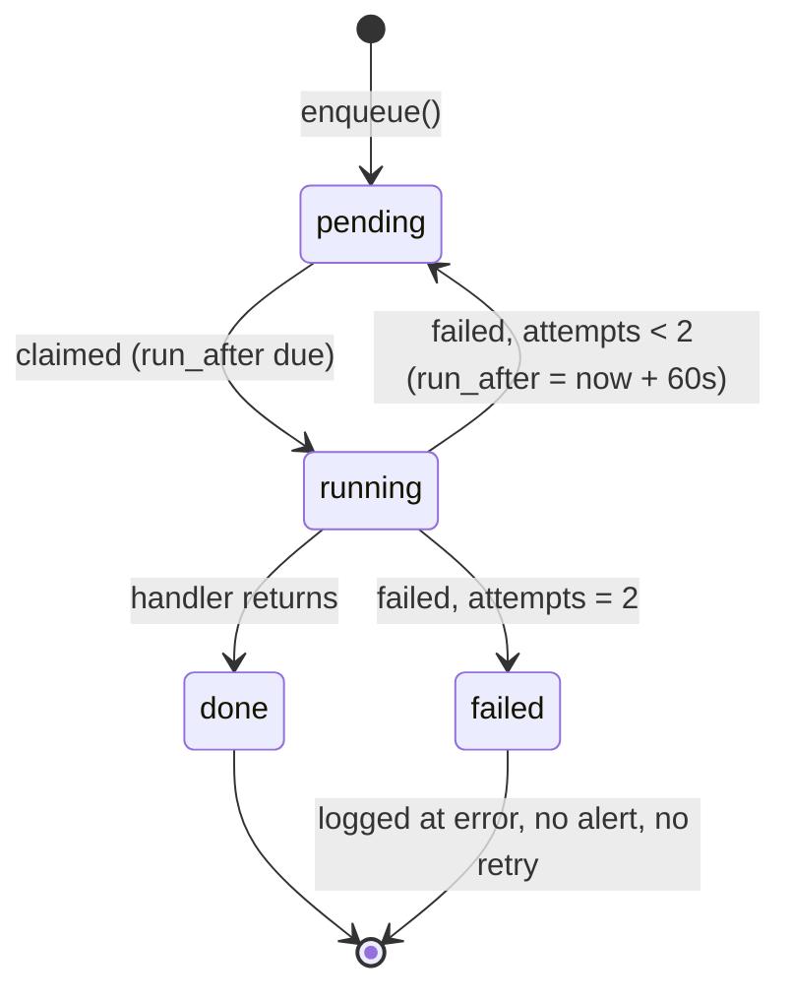

# 04. Backend Engineering

> **Volume 2 — Application Engineering** · Engineering Constitution v1.1 · Status: Active
> **Owner:** Founder (see `governance/ownership.md`)
>
> Governs the layering of the FastAPI application, the service layer, and the background job
> system.

## Contents

- [Purpose](#purpose)
- [Scope](#scope)
- [Sources](#sources)
- [Principles](#principles)
- [Current Reality](#current-reality)
- [Standards](#standards)
- [Known Gaps](#known-gaps)
- [Review Triggers](#review-triggers)

---

## Purpose

Answers *where does my code go, and what must it guarantee*. The backend's structure is
simple and its two hard rules are easy to break silently: the layering that keeps this a
system rather than a graph, and the idempotency that at-least-once job delivery makes a
correctness requirement rather than a nicety.

## Scope

**In scope:** the `api → services → models` layering; dependencies in `api/deps.py`; the
service layer; the model registry; the background job system; async and session discipline.

**Out of scope:** endpoint contracts, status codes, and error shapes (§05); schema and
migrations (§06); authentication and authorization semantics (§07); the AI platform (§09);
testing (§12); Python style (§13).

### Non-goals

- **No repository or unit-of-work pattern.** Services use `AsyncSession` directly. An
  abstraction over SQLAlchemy would buy swappability nobody wants and cost clarity.
- **No dependency-injection container.** FastAPI's `Depends` is the whole mechanism.
- **No separate worker process.** The worker runs in the API's `lifespan`. See
  `ADR-0002` and `RISK-1`.
- **No synchronous database access.** The stack is async end to end.
- **No business logic in routers.** See `BE-2`.

## Sources

Written from: `backend/app/main.py`; `backend/app/api/deps.py`; `backend/app/db.py`;
`backend/app/workers/jobs.py`; `backend/app/models/__init__.py`; the 24 modules in
`backend/app/services/`; the 23 routers in `backend/app/api/`.

---

## Principles

**P1 — Dependencies point one way.** `api → services → models`. Nothing below imports from
above. This is the only structural rule, and nothing enforces it.

**P2 — Routers are plumbing.** Parse, authorize, delegate, serialize. Business logic that
lives in a router cannot be reused by a job handler, and every AI workflow in this product is
a job handler.

**P3 — Every handler must be safe to re-run.** Delivery is at-least-once: the worker retries
once, and `run_after` makes deliberate re-scheduling routine. Idempotency is therefore a
correctness property, not a defensive nicety.

**P4 — Pure where it can be.** Scoring math takes plain dataclasses and touches no database,
so it unit-tests without one. Keep that boundary.

**P5 — Nothing is lost on restart.** Background work is persisted before it is run.

---

## Current Reality

### Layering

```
backend/app/
  main.py       app factory, router mounting, handler registration, security headers
  config.py     pydantic-settings Settings, accessed via lru_cache'd get_settings()
  db.py         async engine + get_db
  security.py   bcrypt + PyJWT (access, refresh, OAuth state)
  api/          23 routers + deps.py
  schemas/      Pydantic request/response contracts, one module per domain
  services/     24 modules — the actual work
  models/       SQLAlchemy 2.0 async ORM, 52 tables
  workers/      jobs.py
```

There is **no `core/`**; cross-cutting concerns sit at the `app/` top level. Roughly 12,400
lines of Python.

The largest file is `api/submissions.py` at 766 lines — the marking, review, finalize, and
remark surface — which is where `BE-2` is under most pressure.

### Dependencies

`api/deps.py` holds the entire dependency surface:

| Symbol | What it does | Used? |
|---|---|---|
| `DbSession` | `Annotated[AsyncSession, Depends(get_db)]` | Yes, everywhere |
| `get_current_user` / `CurrentUser` | Decodes the access token, loads the `User`, rejects when the token's `token_version` ≠ the user's | Yes, everywhere |
| `TutorUser` | `CurrentUser` plus a tutor-or-admin gate | Yes — 38 routes |
| `StudentUser` | `CurrentUser` plus a student gate | Yes — 13 routes |
| `require_role(*roles, detail=...)` | Builds a gate dependency with a custom 403 message | Once, `reports.generate` |
| `assert_tutor` / `assert_student` | The same condition in imperative form | The 7 ownership helpers |
| `get_current_org_id` / `CurrentOrg` | Returns `user.organization_id` for scoping | **Never called** |

`get_current_user` raises four distinct 401 messages: `Not authenticated`, `Invalid or
expired token`, `User no longer exists`, `Token has been revoked`.

**Authorization is a dependency, not a call.** A handler declares the role it needs in its
signature:

```python
@router.get("", response_model=PreferencesOut)
async def get_preferences(db: DbSession, user: TutorUser) -> PreferencesOut:
    ...
```

Of 125 routes, 38 are tutor-gated, 13 student-gated, 66 authenticated without a role gate
(they branch on role internally, or serve every role), and 8 are public — the six auth
endpoints plus the two health ones.

**Why the signature and not the body.** The imperative form fails **open**: a handler that
omits the line has no role check, and nothing detects it. The dependency form fails closed,
because a request cannot be resolved without it. This is not hypothetical — until recently
this codebase had ten byte-identical `_require_tutor` copies plus one `_require_student`,
called at the top of 35 handler bodies, while `require_role` sat in `deps.py` unused
(`RISK-7`).

Ownership helpers that sit *below* the routing layer — `_owned_group`, `_owned_assignment`,
`_tutor_submission` and four others — take a plain `User` rather than a request-scoped
dependency, so they keep their check and call the shared `assert_tutor()`. That matters more
than it looks: nine `groups.py` handlers have no gate of their own and rely entirely on
`_owned_group`'s.

Organization scoping is still applied ad hoc, per query, using `user.organization_id`.

### Services

24 modules, each owning one area. The shape that recurs and is worth copying: **a pure core
plus a database-facing shell**. `services/readiness_factors.py` (284 lines) is pure scoring
math over dataclasses; `services/readiness_v2.py` (356 lines) gathers rows and calls it. The
same split exists in v1 between `readiness.py`'s pure functions and `recompute_student()`.

`services/ai.py` (448 lines) is the single choke point for both AI SDKs — see §09.

Services take an `AsyncSession` as their first argument and **do not commit**, except where
they own a whole unit of work. The caller — router or job handler — commits.

### Models

52 tables across 16 modules. **`models/__init__.py` is a re-export barrel with an explicit
`__all__`**, and it is load-bearing twice over: Alembic's `env.py` imports from it to build
`target_metadata`, and the test suite builds its schema from `Base.metadata`. A model not
re-exported therefore **silently gets no table in tests** while working fine in production
against a hand-written migration — a failure mode that presents as an inexplicable test error
far from its cause.

`Job` lives in `models/homework.py`, not in `workers/` — a historical placement worth knowing
when searching for it.

### Background jobs

`workers/jobs.py` is 110 lines. The whole system:

- **Persistence:** a `Job` row with `type`, `payload` (JSON), `status`, `attempts`, `error`,
  and nullable `run_after`.
- **Registration:** `register_handler(type, fn)` into a module-level dict. All 8 handlers are
  registered at the top of `main.py`: `extract_assignment`, `extract_past_paper`,
  `mark_submission`, `recompute_readiness`, `compute_readiness_v2`, `generate_report`,
  `extract_syllabus`, `sync_classroom`.
- **Claim:** oldest pending job whose `run_after` is null or past, `ORDER BY Job.id LIMIT 1`,
  `with_for_update(skip_locked=True)` — so multiple workers would be safe without change.
- **Execution:** the handler runs in its own session, which the worker commits.
- **Failure:** `MAX_ATTEMPTS = 2`. A first failure returns the job to `pending`; a second
  marks it `failed`. The error is written to `Job.error` and logged with a traceback.
- **Loop:** `worker_loop()` polls every `POLL_SECONDS = 2.0` when idle, catches every
  exception except `CancelledError`, and continues.
- **Lifecycle:** started in `main.py`'s `lifespan` as an `asyncio` task wrapped in
  `_supervised_worker()`, which logs at `error` and restarts the loop after
  `WORKER_RESTART_SECONDS` (5s) if it raises *or* returns, and re-raises `CancelledError` so
  shutdown still stops it. The bare `create_task(worker_loop())` it replaced meant a single
  unhandled exception ended every AI workflow for the life of the process, silently.



**A retry waits 60 seconds.** The `attempts < MAX_ATTEMPTS` branch sets
`run_after = now + RETRY_BACKOFF_SECONDS` before returning the job to `pending`, so the second
attempt is not claimed on the next poll. It previously left `run_after` untouched and both
attempts were spent within about two seconds — fine for a transient network blip, exactly
wrong for the provider rate limits and timeouts a retry budget exists to survive.

**`run_after` is the scheduling primitive.** `enqueue_readiness_v2_debounced()` is built on
it: it no-ops if a run for that (student, subject) is already pending, and otherwise schedules
one `READINESS_V2_COALESCE_SECONDS` (default 600) out — so a burst of auto-finalized
submissions costs one synthesis call instead of one per submission.

**Idempotency, per handler, as implemented:**

| Handler | Mechanism |
|---|---|
| `extract_assignment` | **Replaces** the question list rather than appending |
| `extract_past_paper` | Same extractor, same replacement semantics |
| `mark_submission` | Updates existing `QuestionMark` drafts in place; **never overwrites a tutor-finalized mark**; skips the AI call entirely when every question is decided |
| `recompute_readiness` | Recomputes from evidence and upserts `TopicReadiness` |
| `compute_readiness_v2` | Deliberately **append-only** — a re-run is a new audited evaluation, not a duplicate |
| `generate_report` | Writes into the existing `Report` row |
| `extract_syllabus` | Replaces the draft on the `SyllabusUpload` |
| `sync_classroom` | `ClassroomWorkLink` makes re-polling idempotent — an already-imported item is updated, never duplicated |

Downstream, `build_homework_evidence()` is idempotent by `source_ref`.

**Tests drive jobs synchronously** by calling `process_one_job()` directly; they never run the
loop. See §12.

### Sessions and async

`db.py` is 24 lines: an async engine from `settings.database_url` and an `async_session`
factory, with `get_db` yielding a session per request.

The entire stack is async. The worker shares the API's event loop, so **a blocking call in any
handler blocks request serving too** — see §10.

---

## Standards

### Structure

**`BE-1` — MUST NOT · Critical · Active**
A lower layer never imports from a higher one. `models/` imports nothing from `services/`;
`services/` imports nothing from `api/`.
*Rationale:* the layering is the only thing keeping this a system rather than a graph, and it
is enforced by convention alone (`GOV-7`).

**`BE-2` — MUST · Important · Active**
Business logic lives in `services/`. Routers parse, authorize, delegate, and serialize.
*Rationale:* every AI workflow is a job handler, and a job handler cannot call a router.
Logic in a router is logic the background pipeline cannot reuse.

**`BE-3` — MUST · Critical · Active**
Every model is re-exported from `models/__init__.py` with an entry in `__all__`.
*Rationale:* Alembic's `env.py` and the test schema both build from that barrel; a missing
model silently has no table in tests while working in production.

**`BE-4` — SHOULD · Recommended · Active**
Keep scoring and other decision math pure — plain dataclasses in, values out, no session.
Put database gathering in a separate module that calls it.
*Rationale:* `readiness_factors.py` and `readiness_v2.py` are the model; the pure half is the
only part of the engine testable without fixtures.

**`BE-5` — SHOULD · Recommended · Active**
A service takes `AsyncSession` as its first parameter and does not commit. The caller commits.
*Rationale:* a service that commits cannot participate in a caller's larger transaction.

### Jobs

**`BE-6` — MUST · Critical · Active**
Every job handler is safe to re-run on the same payload, and the mechanism is stated in its
docstring.
*Rationale:* delivery is at-least-once — the worker retries once and `run_after` re-schedules
deliberately. A non-idempotent handler duplicates marks, evidence, or AI spend.

**`BE-7` — MUST · Critical · Active**
A job handler never overwrites a value a human has finalized.
*Rationale:* `mark_submission` re-running must not undo a tutor's decision; §01 P4 is only
real if the pipeline respects it.

**`BE-8` — MUST · Important · Active**
Adding an asynchronous workflow means: write the handler, `register_handler` it in `main.py`,
and give it a caller that `enqueue()`s it. Handlers take `(session, payload)` and return
`None`.
*Rationale:* an unregistered type fails at claim time with "No handler registered", after the
row has already been created and an attempt consumed.

**`BE-9` — MUST · Important · Active**
Job payloads carry identifiers, not objects. Handlers re-read current state from the database.
*Rationale:* a payload is a snapshot from enqueue time; by the time a debounced job runs, ten
minutes may have passed and the row may have changed.

**`BE-10` — SHOULD · Important · Active**
Coalesce bursty work with `enqueue_readiness_v2_debounced()`'s pattern: no-op if a run is
already pending, otherwise schedule one `run_after` in the future.
*Rationale:* one Opus synthesis per burst rather than per submission — a cost decision as much
as a load one (§10).

**`BE-11` — MUST · Important · Active**
A handler that fails persists a user-meaningful reason to its domain error column
(`extraction_error`, `ai_error`, `Report.error`, `ReadinessSnapshot.error`), not only to
`Job.error`.
*Rationale:* `Job.error` is invisible to the product; the domain column is what the interface
shows the tutor.

**`BE-12` — SHOULD · Important · Active**
A handler that partially succeeds preserves the work it completed rather than discarding it.
*Rationale:* `compute_readiness_v2` keeps its Layer 1 factor rows and writes
`status="failed"` — the pattern to follow (`governance/engineering-philosophy.md` §4).

### Async and sessions

**`BE-13` — MUST NOT · Critical · Active**
Never make a blocking call in a request handler, service, or job handler. Use the async client
for I/O; move genuinely CPU-bound work to a thread.
*Rationale:* the worker shares the API's event loop, so one blocking call stalls request
serving for every user.

**`BE-14` — MUST · Important · Active**
A session is not shared across concurrent tasks. Each request and each job execution gets its
own.
*Rationale:* `AsyncSession` is not concurrency-safe; sharing produces interleaved statements
and errors that do not reproduce.

**`BE-15` — MUST · Important · Active**
Read configuration through `get_settings()`, never `os.environ` directly.
*Rationale:* `get_settings()` is `lru_cache`d and applies the `postgres://` →
`postgresql+asyncpg://` rewrite that hosting providers make necessary.

### Authorization

**`BE-16` — MUST · Critical · Active**
Every endpoint that is not deliberately public enforces a role check, and every query
returning tenant data filters by organization.
*Rationale:* `PROD-4`; nothing detects an endpoint that forgot.

**`BE-17` — MUST · Critical · Active**
A role gate is declared in the handler signature — `user: TutorUser` or `user: StudentUser`
from `api/deps.py`, or `require_role(...)` where the 403 message must differ. Never a
module-local `_require_tutor` helper called from the handler body.
*Rationale:* a dependency in the signature fails closed; an imperative call in the body fails
open when omitted, with nothing to detect it. Promoted from Draft when the eleven hand-copied
helpers were converged onto the shared dependency; `tests/test_authorization.py` now fails if
a route loses its gate or a router grows its own copy again. `SEC-11`, `RISK-7`.

**`BE-18` — MUST · Important · Active**
An ownership helper below the routing layer takes a plain `User` and calls `assert_tutor()` /
`assert_student()` from `api/deps.py` rather than repeating the condition.
*Rationale:* seven helpers (`_owned_group`, `_owned_entry`, `_owned_upload`,
`_owned_assignment`, `_owned_lesson`, `_tutor_student`, `_tutor_submission`) carry the role
check for handlers that have none of their own — nine in `groups.py` alone. They are the same
copy-paste surface as the routers were, one layer down.

---

## Known Gaps

| Gap | Why it matters | Severity |
|---|---|---|
| **`get_current_org_id` and `CurrentOrg` are still dead code.** Organization scoping is applied per query against `user.organization_id`. | That satisfies `SEC-7`, but by convention rather than by mechanism — a query that forgets the filter is not detectable the way a missing role gate now is. Do not cite `CurrentOrg` as the scoping mechanism; it is not one. `RISK-7` residual. | `before scale` |
| **A failed job is terminal.** It is logged at `error` with the job id, type, attempt count and message, but there is no alert, no dead-letter queue and no metric. | Marking stops for that submission and nobody is told unless someone reads the logs or polls `/health/ready`. `RISK-4` residual; see §11. | `before scale` |
| **Nothing announces a stalled queue.** `/health/ready` reports depth, oldest-pending age and worker state, but only when something asks. | Visible is not the same as announced. Closing this needs an external uptime monitor polling the endpoint — a configuration step outside the repo. `RISK-4` residual. | `before scale` |
| **`api/submissions.py` is 766 lines.** | The most safety-critical surface in the product — marking, finalize, override, remark — is also the least navigable. `BE-2` is under most pressure here. | `before scale` |
| **`BE-1` is unenforceable.** Nothing checks import direction. | `GOV-7` and `BE-1` are Critical rules with no mechanism. An import linter would fix it. | `before scale` |
| **`schemas/__init__.py` is empty** while `models/__init__.py` is a barrel. | Harmless but inconsistent; a reader reasonably expects the same convention in both. | `nice to have` |

---

## Review Triggers

Update this document when:

- A job handler is added, removed, or changes its idempotency mechanism.
- `workers/jobs.py` changes — retry policy, claim query, polling, or backoff.
- `api/deps.py` gains or loses a dependency, or `CurrentOrg` is adopted.
- A route's role gate changes, or `tests/test_authorization.py`'s `PUBLIC_ROUTES` grows.
- The worker's supervision or health reporting changes.
- The worker moves out of the API process.
- A new top-level package appears under `backend/app/`.
- The layering rule changes or gains enforcement.
