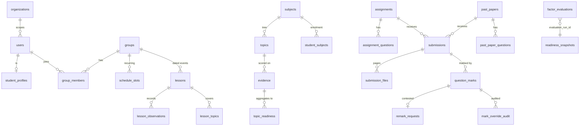

# 06. Database Design

> **Volume 2 — Application Engineering** · Engineering Constitution v1.2 · Status: Active
> **Owner:** Founder (see `governance/ownership.md`)
>
> Governs the schema, its conventions, and the migration process.

## Contents

- [Purpose](#purpose)
- [Scope](#scope)
- [Sources](#sources)
- [Principles](#principles)
- [Current Reality](#current-reality)
  - [The schema by domain](#the-schema-by-domain)
  - [Conventions](#conventions)
  - [Indexes — models and database disagree](#indexes--models-and-database-disagree)
  - [Constraints](#constraints)
  - [Migrations](#migrations)
- [Standards](#standards)
- [Known Gaps](#known-gaps)
- [Review Triggers](#review-triggers)

---

## Purpose

Answers *what is in the database, why is it shaped this way, and how do I change it safely*.
Fifty-two tables across sixteen modules, with conventions that are unusually consistent in
some dimensions and unusually thin in others.

It also records a discrepancy nobody had noticed: **the ORM models and the migrated database
do not agree about indexes**, which means the test schema is not the production schema.

## Scope

**In scope:** every table and its domain; primary keys, timestamps, enums, JSON columns;
constraints and cascades; indexing; the migration convention and its SQLite constraints;
transaction and session rules; retention.

**Out of scope:** the services that query it (§04); the API that exposes it (§05); query
performance tuning (§10); backup and restore procedures (§14).

### Non-goals

Detailed with triggers in `governance/non-goals.md`. In brief: **no UUID primary keys**, **no
soft deletes**, **no native database enums**, **no ORM-generated migrations**, **no read
replicas or multi-region**, **no event sourcing**.

## Sources

Written from: all 16 modules in `backend/app/models/`; all 21 migrations in
`backend/alembic/versions/`; `backend/alembic/env.py`; `backend/alembic.ini`;
`backend/app/db.py`; `backend/app/config.py`; `backend/tests/conftest.py`.

---

## Principles

**P1 — The schema is the audit trail.** Where history matters, Avora writes an append-only
table rather than mutating a row. `evidence`, `factor_evaluations`, `mark_override_audit`,
and `readiness_history` exist so a number can name its inputs (§01 P2).

**P2 — Consistency across 52 tables beats local optimality.** Integer keys, `VARCHAR` enums,
timezone-aware timestamps — each is arguable in isolation and correct as a rule.

**P3 — The test database must resemble the production database.** Every schema decision is
constrained by SQLite, because that is what the test suite runs on. Where the two diverge,
tests stop being evidence.

**P4 — Migrations are code and are reviewed as code.** Hand-written, sequential, reversible.

---

## Current Reality

### The schema by domain

52 tables. Grouped by the module that defines them:

| Module | Tables |
|---|---|
| `orgs.py` | `organizations` |
| `users.py` | `users` |
| `syllabus.py` | `subjects`, `topics`, `syllabus_uploads` |
| `groups.py` | `groups`, `group_members`, `invites`, `parent_links`, `schedule_slots` |
| `lessons.py` | `lessons`, `lesson_topics`, `lesson_observations` |
| `crm.py` | `student_profiles`, `student_subjects`, `tutor_notes`, `parent_communications` |
| `homework.py` | `classifieds`, `assignments`, `assignment_questions`, `question_topics`, `submissions`, `submission_files`, `question_marks`, `mark_override_audit`, `remark_requests`, **`jobs`** |
| `readiness.py` | `evidence`, `topic_readiness`, `readiness_history`, `tutor_observations`, `assessments`, `assessment_scores`, `tutor_preferences` |
| `readiness_v2.py` | `mistakes`, `past_papers`, `past_paper_questions`, `past_paper_question_topics`, `past_paper_attempts`, `grade_boundaries`, `readiness_weights`, `factor_evaluations`, `readiness_snapshots` |
| `knowledge.py` | `knowledge_entries` |
| `chat.py` | `chat_conversations`, `chat_messages` |
| `reports.py` | `reports` |
| `resources.py` | `group_resources` |
| `ai_usage.py` | `ai_usage_events` |
| `classroom.py` | `google_accounts`, `classroom_course_links`, `classroom_work_links` |

`jobs` lives in `homework.py` rather than with the worker — historical, and worth knowing when
searching.



The diagram shows the spine, not all 52 tables. Note `submissions` receiving from **both**
`assignments` and `past_papers` — the polymorphism from `ADR-0004`.

### Conventions

**Primary keys.** Uniformly `id: Mapped[int] = mapped_column(primary_key=True)` — integer
autoincrement on all 52 tables. **No UUIDs anywhere.** The one UUID-shaped value,
`evaluation_run_id: Mapped[str] = mapped_column(String(36))` on `factor_evaluations` and
`readiness_snapshots`, is a correlation key, not a primary key.

**Base and mixins.** `models/base.py` is 18 lines in total:

```python
def utcnow() -> datetime: return datetime.now(timezone.utc)
class Base(DeclarativeBase): pass
class TimestampMixin:
    created_at: Mapped[datetime] = mapped_column(
        DateTime(timezone=True), default=utcnow, nullable=False)
```

`TimestampMixin` provides **`created_at` only** — no `updated_at`, and no `id`. Declaration
order is `class Foo(TimestampMixin, Base)`.

**Timestamps.** Three patterns coexist:

1. `TimestampMixin` — most models.
2. Append-only tables declaring `created_at` explicitly instead of using the mixin:
   `Evidence`, `ReadinessHistory` (as `recorded_at`), `MarkOverrideAudit`, `RemarkRequest`,
   `FactorEvaluation`, `ReadinessSnapshot`, `AiUsageEvent`.
3. `updated_at` on exactly **four** models — `StudentProfile`, `Job`, `ChatConversation`,
   `TopicReadiness` — always `default=utcnow, onupdate=utcnow`.

All datetimes are `DateTime(timezone=True)`. `Date` is used for calendar-only fields
(`Lesson.date`, `Assessment.date`, `PastPaperAttempt.attempted_at`, `Submission.attempted_at`)
and `Time` for `ScheduleSlot.start_time`.

**Enums — the most consistent convention in the codebase.** All 22 enum types are
`str, enum.Enum` in Python and `Enum(X, native_enum=False, length=N)` in the column: a
`VARCHAR` with a check constraint, never a native Postgres enum. **Adding a member requires
no migration**, stated explicitly in `0020_past_papers.py:12`. `ai_usage_events.provider` goes
further and is a plain `String(16)`, so adding an AI provider never touches the schema. See
`ADR-0007`.

**JSON columns** are generic `sqlalchemy.JSON`, never `JSONB`, for SQLite parity:
`jobs.payload`, `subjects.grade_boundaries`, `syllabus_uploads.draft`,
`factor_evaluations.detail`, `readiness_snapshots.weak_topics`.

**Soft deletes: none.** No `deleted_at`, `is_deleted`, or archive flag anywhere in
`backend/app/` — verified by search. Deletion is `await db.delete(row)`, relying on ORM
cascades.

**Nullability that carries meaning:**

- `users.email` and `users.username` are **both nullable** and both unique, because young
  students may have no email address.
- `assignments.classified_id` is nullable — homework can exist without a booklet.
- `factor_evaluations.score` is nullable, and **null means "no data"**, which is what makes
  §01 P3 representable rather than merely displayed.

### Indexes — models and database disagree

**This is the finding worth reading twice.**

The ORM models declare exactly **one** index:

```python
__table_args__ = (Index("ix_jobs_status_run_after", "status", "run_after"),)   # homework.py:312
```

No column anywhere uses `index=True`.

The migrations, however, create **five**:

| Index | Table and columns | Migration |
|---|---|---|
| `ix_evidence_student_topic` | `evidence(student_id, topic_id)` | 0004 |
| `ix_factor_evaluations_run_student_subject` | `factor_evaluations(evaluation_run_id, student_id, subject_id)` | 0016 |
| `ix_readiness_snapshots_student_subject` | `readiness_snapshots(student_id, subject_id, created_at)` | 0016 |
| `ix_jobs_status_run_after` | `jobs(status, run_after)` | 0018 |
| `ix_mark_override_audit_question_mark_id` | `mark_override_audit(question_mark_id)` | 0019 |

**Four of the five exist only in migrations.** The consequences are concrete:

- **The test schema is not the production schema.** `tests/conftest.py` builds from
  `Base.metadata.create_all`, so tests run against a database missing four indexes that
  production has.
- **Reading the models misleads.** An engineer inspecting `models/readiness.py` sees no index
  on `evidence` and may add a duplicate.
- **A `create_all` in any environment silently loses them.**

Beyond these five, indexing relies on primary keys and the implicit indexes behind unique
constraints. **Foreign key columns are not indexed** — Postgres does not index them
automatically — so every join and every `WHERE parent_id = ?` on a large table is a sequential
scan.

### Constraints

**Unique constraints** carry real semantics, not just hygiene:

| Constraint | What it guarantees |
|---|---|
| `remark_requests(question_mark_id)` | **One remark request per question, ever** — the anti-gaming guarantee, enforced by the database rather than by application logic |
| `submissions(assignment_id, student_id)` and `submissions(past_paper_id, student_id)` | One submission per student per piece of work, for each polymorphic branch |
| `question_marks(submission_id, question_id)` and `(submission_id, past_paper_question_id)` | One mark per question per submission |
| `subjects(exam_board, code)` | Exam board is part of subject identity |
| `topics(subject_id, code)`, `lesson_topics(lesson_id, topic_id)`, `question_topics(question_id, topic_id)` | Join-table integrity |
| `group_members(group_id, student_id)`, `parent_links(parent_id, student_id)`, `student_subjects(student_id, subject_id)` | No duplicate membership |
| `grade_boundaries(organization_id, subject_id, grade_label)` | One boundary per grade per subject per organization |
| `classroom_course_links(google_account_id, classroom_course_id)`, `classroom_work_links(course_link_id, classroom_coursework_id)` | What makes Classroom re-sync idempotent |

Column-level `unique=True`: `users.email`, `users.username`, `invites.code`,
`tutor_preferences.tutor_id`, `readiness_weights.organization_id`,
`student_profiles.student_id`, `google_accounts.tutor_id`, `classroom_course_links.group_id`,
`classroom_work_links.assignment_id`.

**Cascades are ORM-level only.** Ten relationships declare `cascade="all, delete-orphan"`
(`Assignment.questions`, `AssignmentQuestion.topics`, `Submission.files`, `Submission.marks`,
`Subject.topics`, `Group.members`, `Group.schedule_slots`, `ChatConversation.messages`,
`GoogleAccount.course_links`, `ClassroomCourseLink.work_links`).

**No ForeignKey anywhere declares `ondelete=`** — verified by search across both `models/` and
`alembic/versions/`. Nothing is enforced at the database level, so a delete that bypasses the
ORM, or touches a row not covered by a mapped relationship, leaves orphans that no constraint
will catch.

**The polymorphic invariant is not enforced by the database.** `Submission` must have exactly
one of `assignment_id` / `past_paper_id`, and `QuestionMark` exactly one of `question_id` /
`past_paper_question_id`. The unique constraints permit rows with both set or neither. Only
application code maintains it.

### Migrations

A linear chain, `0001` → `0021`, with string revision ids matching the filename prefix and
`down_revision` chained.

```
0001_users                        0012_organizations           (184 lines — largest)
0002_groups_syllabus              0013_student_crm
0003_homework                     0014_lessons
0004_readiness                    0015_knowledge_base_ai_usage
0005_chat                         0016_readiness_v2_schema     (196 lines)
0006_reports                      0017_google_classroom
0007_assignment_optional_classified  0018_ai_provider_and_job_scheduling
0008_group_resources              0019_auto_marking_review_queue
0009_tutor_preferences            0020_past_papers             (162 lines)
0010_user_token_version           0021_invite_single_use
0011_syllabus_uploads
```

`alembic/env.py` reads the URL from `get_settings().database_url` rather than from
`alembic.ini`, and sets `target_metadata = Base.metadata`. Migrations run at container start:
the Dockerfile's command is `alembic upgrade head && uvicorn app.main:app`, so **a failing
migration means the service never starts**.

**The SQLite batch-mode pattern.** Migrations altering existing columns must use
`op.batch_alter_table(..., naming_convention=NAMING)` with an explicit naming convention,
because SQLite rebuilds tables on `ALTER` and refuses unnamed reflected constraints. From
`0020_past_papers.py:22–28`:

```python
NAMING = {
    "fk": "fk_%(table_name)s_%(column_0_name)s_%(referred_table_name)s",
    "uq": "uq_%(table_name)s_%(column_0_N_name)s",
}
```

New ForeignKeys in such a migration also need an explicit `name=`. This was discovered
painfully in 0020 and must be reused rather than rediscovered.

**Migrations are never exercised by the test suite** — `conftest.py` builds the schema from
`Base.metadata.create_all` and forces in-memory SQLite, so `pytest` proves nothing about
Alembic. **CI is what exercises them.** The `migrations` job in `.github/workflows/ci.yml`
runs `upgrade head` → `downgrade base` → `upgrade head` against a real `postgres:16-alpine`
service container on every pull request, so all 21 migrations and all 21 downgrades run before
a merge rather than for the first time in production.

**What that check still cannot see.** The CI database is **empty**. It proves the schema
operations are valid and reversible; it cannot prove a migration is safe against existing
rows, which is precisely how 0012 failed — a non-nullable column added to a populated table.
`DB-18` remains enforced by review. This is the residual of `RISK-3`.

`config.py` rewrites `postgres://` and `postgresql://` to `postgresql+asyncpg://`
automatically, because hosting providers hand out the bare scheme.

---

## Standards

### Schema conventions

**`DB-1` — MUST · Important · Active**
New tables use an integer autoincrement primary key named `id`.
*Rationale:* consistency across 52 tables; see `governance/non-goals.md` for why not UUIDs,
including the enumerability that `API-7` then has to handle.

**`DB-2` — MUST · Critical · Active**
Every new top-level aggregate carries a non-nullable `organization_id`. Child rows scope
through their parent.
*Rationale:* `PROD-3`. A table missing it turns `ADR-0005`'s bet into a migration.

**`DB-3` — MUST · Important · Active**
Every table records creation time, via `TimestampMixin` or an explicit `created_at`. Add
`updated_at` only to tables that are genuinely mutated in place.
*Rationale:* an undated row cannot be decayed, audited, or retention-pruned — and evidence
decay is central to this product.

**`DB-4` — MUST · Important · Active**
All datetimes are `DateTime(timezone=True)`. Use `Date` only for genuinely calendar-only
values.
*Rationale:* the readiness engine computes ages in days; a naive datetime silently shifts a
score.

**`DB-5` — MUST · Important · Active**
Enum columns are `Enum(SomeEnum, native_enum=False, length=N)` over a `str, enum.Enum`.
*Rationale:* `ADR-0007` — no migration to add a member, and it works on SQLite.

**`DB-6` — MUST · Important · Active**
When adding an enum member, audit every `if`/`match` over that enum. Adding a member is
invisible to existing branches.
*Rationale:* the direct cost of `DB-5`: no migration means no moment that forces the review.

**`DB-7` — MUST · Important · Active**
JSON columns use generic `sqlalchemy.JSON`, never `JSONB`.
*Rationale:* SQLite parity — `P3`.

**`DB-8` — SHOULD NOT · Important · Active**
Do not add soft deletes. Where history matters, add an append-only table.
*Rationale:* `governance/non-goals.md` — a soft-delete filter forgotten in one query is a data
leak, and the schema already has the append-only idiom.

**`DB-9` — MUST · Important · Active**
Where null carries meaning — `factor_evaluations.score` meaning "no data" — say so in the
model's docstring or a comment.
*Rationale:* an undocumented meaningful null gets "fixed" to `0`, which is `PROD-2`.

### Constraints and integrity

**`DB-10` — MUST · Critical · Active**
An invariant the product depends on is enforced by a database constraint wherever it can be.
*Rationale:* `remark_requests(question_mark_id)` is the model — one request per question is a
guarantee because the database refuses the second, not because code remembers to check.

**`DB-11` — MUST · Important · Active**
Every foreign key that is filtered or joined in a query has an index.
*Rationale:* Postgres does not index foreign keys automatically; every such column is
currently a sequential scan. See §10.

**`DB-12` — MUST · Critical · Active**
An index is declared in the **model** via `__table_args__` as well as created in the
migration.
*Rationale:* four of the five existing indexes exist only in migrations, so the test schema
differs from production and the models misinform the reader.

**`DB-13` — SHOULD · Important · Active**
New foreign keys declare an explicit `ondelete=` — `CASCADE`, `SET NULL`, or `RESTRICT` —
matching the ORM cascade.
*Rationale:* today nothing is enforced at the database level, so any delete outside a mapped
relationship orphans rows silently.

**`DB-14` — SHOULD · Important · Active**
A "exactly one of these columns" invariant gets a `CheckConstraint`.
*Rationale:* the polymorphic `Submission` and `QuestionMark` invariants are maintained by
application code alone; a check constraint would make an impossible row impossible.

### Migrations

**`DB-15` — MUST · Critical · Active**
Migrations are hand-written, named `NNNN_short_name.py` continuing the sequence, with
`down_revision` set to the previous revision. Autogenerate may seed a draft; its output is
never the migration.
*Rationale:* autogenerate misses data migrations entirely and does not understand SQLite batch
mode, which this project has already had to work around by hand.

**`DB-16` — MUST · Critical · Active**
Every migration has a working `downgrade()`, verified up → down → up before merge.
*Rationale:* a migration runs at container start, so a failure with no way back means the
service does not start at all. CI's `migrations` job runs this cycle on Postgres 16 for every
PR, so the rule is now checked rather than asserted.

**`DB-17` — MUST · Critical · Active**
A migration altering an existing table uses `op.batch_alter_table(...,
naming_convention=NAMING)` with the convention from `0020_past_papers.py`, and gives new
ForeignKeys an explicit `name=`.
*Rationale:* SQLite rebuilds tables on `ALTER` and refuses unnamed reflected constraints; this
was rediscovered painfully once.

**`DB-18` — MUST · Critical · Active**
A migration that adds a non-nullable column to a populated table provides a server default or
backfills in the same migration, and is tested against data.
*Rationale:* migration 0012 failed exactly this way on Postgres with existing users.

**`DB-19` — SHOULD · Important · Active**
A migration is verified against Postgres, not only SQLite, before merge.
*Rationale:* `RISK-3` — the failures that have occurred were Postgres-specific, and SQLite
cannot catch them.

### Retention

**`DB-20` — MUST · Important · Draft**
Append-only tables have a stated retention policy. For `factor_evaluations`: retain all rows
for **90 days**, then retain only rows belonging to the **most recent 3 evaluation runs per
(student, subject)**, deleting the rest. `readiness_snapshots` follows the same rule so a
retained snapshot always keeps its factor rows.
*Rationale:* one row per factor per run, unbounded, on the product's most frequent background
job — flagged as needed in two prior documents and never written. **Draft** until the pruning
job exists; the numbers are the proposal to implement.

**`DB-21` — MUST · Important · Active**
A new append-only table states its growth rate and retention position when it is added.
*Rationale:* `factor_evaluations` reached this point unnoticed because nobody was asked at the
time.

### Access

**`DB-22` — MUST · Important · Active**
All database access is async, through the `AsyncSession` provided by `get_db` or
`async_session`.
*Rationale:* `BE-13` — a sync driver blocks the loop the API and the worker share.

**`DB-23` — MUST NOT · Important · Active**
Never build SQL by string interpolation. Use SQLAlchemy constructs or bound parameters.
*Rationale:* injection, and the ORM is used everywhere else so an exception stands out for the
wrong reason.

---

## Known Gaps

| Gap | Why it matters | Severity |
|---|---|---|
| **Four of five indexes exist only in migrations, not in the models.** `evidence`, `factor_evaluations`, `readiness_snapshots`, and `mark_override_audit` indexes are invisible to `Base.metadata`. | The test database is not the production database, so no test exercises an indexed plan; and a reader of the models is misinformed. `DB-12` binds new work; converging the existing four is a one-migration-free change to `__table_args__`. | `blocking` |
| **Foreign key columns are not indexed.** | Every join and parent-id filter on a growing table is a sequential scan. `DB-11` binds new work only. | `before scale` |
| **No ForeignKey declares `ondelete=`.** Cascades are ORM-level only. | Any delete outside a mapped relationship orphans rows, with no constraint to catch it. Uploaded files compound this — see `RISK-8`. | `before scale` |
| **The polymorphic exactly-one invariant has no CHECK constraint.** | A row with both or neither foreign key set is representable, and `API-20`'s trap becomes a data problem rather than a code one. | `before scale` |
| **CI verifies migrations against an empty database.** The `migrations` job runs up → down → up on Postgres 16, but with no rows in any table. | It catches invalid or irreversible schema operations. It cannot catch the failure that actually happened — 0012 added a non-nullable column to a *populated* table. `DB-18` is still enforced by review alone. `RISK-3` residual. | `before scale` |
| **The test suite still runs no migration.** `conftest.py` uses `Base.metadata.create_all` on SQLite. | A model and its migration can drift without any test noticing; only CI's separate Postgres job would catch a migration that fails outright. `DB-12` — four of five indexes exist only in migrations — is a live instance of this drift. | `before scale` |
| **No retention policy is implemented.** `DB-20` is Draft; `factor_evaluations` grows unbounded. | Flagged as needed in two prior documents. The policy now exists on paper; the pruning job does not. | `before scale` |
| **v1 readiness tables are still written and read** — `topic_readiness`, `readiness_history`, `tutor_preferences`. | Three tables and their writes exist to serve three modules that have not been repointed. `RISK-5`. | `before scale` |
| **`updated_at` is inconsistent** — present on 4 models, absent from most. | Nothing depends on it today, but "when did this row last change" is unanswerable for most of the schema. | `nice to have` |

---

## Review Triggers

Update this document when:

- A table, enum, or index is added, removed, or renamed.
- A migration is added — the chain listing and any new convention it establishes.
- The base class or `TimestampMixin` changes.
- `ondelete=` or CHECK constraints are introduced.
- The retention policy in `DB-20` is implemented, moving it from Draft to Active.
- The test database stops being SQLite, which relaxes `DB-5`, `DB-7`, and `DB-17`.
- The v1 readiness tables are dropped.
