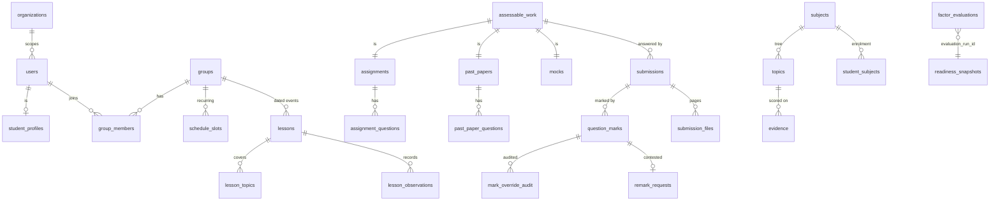

# 06. Database Design

> **Volume 2 — Application Engineering** · Engineering Constitution v1.5 · Status: Active
> **Owner:** Founder (see `governance/ownership.md`)
>
> Governs the schema, its conventions, and the migration process.

## Contents

- [Purpose](#purpose)
- [Scope](#scope)
- [Sources](#sources)
- [Principles](#principles)
- [Current Reality](#current-reality)
  - [The schema by domain](#the-schema-by-domain)
  - [Conventions](#conventions)
  - [Indexes — models and database disagree](#indexes--models-and-database-disagree)
  - [Constraints](#constraints)
  - [Migrations](#migrations)
- [Standards](#standards)
- [Known Gaps](#known-gaps)
- [Review Triggers](#review-triggers)

---

## Purpose

Answers *what is in the database, why is it shaped this way, and how do I change it safely*.
Seventy-eight tables (`len(Base.metadata.tables)`, measured at migration `0071`; `chat.py`'s two
tables were dropped by migration `0026`, task 0.3, AV-57 — `ADR-0007`'s "52 tables" is the
count as of that Accepted, and therefore immutable, decision), with conventions that are unusually consistent in some
dimensions and unusually thin in others.

It also records a discrepancy nobody had noticed: **the ORM models and the migrated database
do not agree about indexes**, which means the test schema is not the production schema.

## Scope

**In scope:** every table and its domain; primary keys, timestamps, enums, JSON columns;
constraints and cascades; indexing; the migration convention and its SQLite constraints;
transaction and session rules; retention.

**Out of scope:** the services that query it (§04); the API that exposes it (§05); query
performance tuning (§10); backup and restore procedures (§14).

### Non-goals

Detailed with triggers in `governance/non-goals.md`. In brief: **no UUID primary keys**, **no
soft deletes** (one deliberate exception, `groups` — see Known Gaps), **no native database enums**, **no ORM-generated migrations**, **no read
replicas or multi-region**, **no event sourcing**.

## Sources

Written from: all 15 modules in `backend/app/models/`; all 25 migrations in
`backend/alembic/versions/`; `backend/alembic/env.py`; `backend/alembic.ini`;
`backend/app/db.py`; `backend/app/config.py`; `backend/tests/conftest.py`.

---

## Principles

**P1 — The schema is the audit trail.** Where history matters, Avora writes an append-only
table rather than mutating a row. `evidence`, `factor_evaluations`, `mark_override_audit`,
and `readiness_snapshots` exist so a number can name its inputs (§01 P2).

**P2 — Consistency across 78 tables beats local optimality.** Integer keys, `VARCHAR` enums,
timezone-aware timestamps — each is arguable in isolation and correct as a rule.

**P3 — The test database must resemble the production database.** Every schema decision is
constrained by SQLite, because that is what the test suite runs on. Where the two diverge,
tests stop being evidence.

**P4 — Migrations are code and are reviewed as code.** Hand-written, sequential, reversible.

---

## Current Reality

### The schema by domain

78 tables. Grouped by the module that defines them. The table below is complete for the
modules it names; the Phase 0–4 additions are listed under it, because this section was last
written before they landed, and the Phase 7–9 tables are named, not described, after those.

| Module | Tables |
|---|---|
| `orgs.py` | `organizations` |
| `users.py` | `users` |
| `syllabus.py` | `subjects`, `topics`, `syllabus_uploads` |
| `groups.py` | `groups` (soft-deleted: see "Deleting a class" below), `group_members`, `invites`, `parent_links`, `schedule_slots` |
| `lessons.py` | `lessons`, `lesson_topics`, `lesson_observations` |
| `crm.py` | `student_profiles`, `student_subjects`, `tutor_notes`, `parent_communications` |
| `homework.py` | `classifieds`, `assignments`, `assignment_questions`, `question_topics`, `submissions`, `submission_files`, `question_marks`, `mark_override_audit`, `remark_requests`, **`jobs`** |
| `readiness.py` | `evidence`, `tutor_observations`, `assessments`, `assessment_scores` (v1's `topic_readiness`, `readiness_history` and `tutor_preferences` were dropped by `0055`, task 5.3b) |
| `readiness_v2.py` | `mistakes`, `past_papers`, `past_paper_questions`, `past_paper_question_topics`, `past_paper_attempts`, `grade_boundaries`, `readiness_weights`, `factor_evaluations`, `readiness_snapshots` |
| `custom_criteria.py` | `custom_criteria`, `custom_criterion_scores`, `custom_criterion_score_audit` (task 5.4b, `0058`) |
| `knowledge.py` | `knowledge_entries` |
| `reports.py` | `reports` |
| `resources.py` | `group_resources` |
| `ai_usage.py` | `ai_usage_events` |
| `narrative.py` | `narratives` |
| `classroom.py` | `google_accounts`, `classroom_course_links`, `classroom_work_links` |
| `teaching_plan.py` | `teaching_plans`, `plan_slots`, `plan_breaks` (Phase 6, `0060`–`0062`; see "The teaching plan" below) |

Tables added by earlier phases that the rows above predate: `chapters` (`syllabus.py`),
`booklets` (`booklets.py`), `mocks`, `mock_openings`, `mock_questions`,
`mock_question_topics` (`mocks.py`), `mistake_categories`, `mistake_topics`,
`mistake_revision_audit` (`readiness_v2.py`), `worker_heartbeats` (`workers.py`).

Tables added by Phases 7–9, named here and **not yet described in this document**:
`contact_points`, `lesson_attendance`, `lesson_meeting_imports`, `meeting_connections`,
`meeting_participants`, `notification_preferences`, `notifications`, `setup_acknowledgements`,
`taught_before_topics`, `weekly_sends`, `whatsapp_opt_outs`. The twelfth and thirteenth tables added
since Phase 6 are `dismissed_prompts` and `attempt_redos`, described next.

**`dismissed_prompts`** (`models/dismissal.py`, migration `0069`). A tutor's "Not now" on
something their home page asked of them. Columns: `id`, `organization_id` (FK `organizations.id`,
NOT NULL), `user_id` (FK `users.id`, NOT NULL), `key` (`String(120)`, NOT NULL), `created_at`
(`TimestampMixin`; no `updated_at`). Unique on `(user_id, key)` as `uq_dismissed_prompts_user_id_key`,
which is what makes hiding twice one row. `key` is an opaque label the frontend chose
(`chapter_prompt:12:340`): it is never resolved to a row, so storing one grants nothing. The
service (`services/dismissals.py`) accepts only the exact key `setup_guide` and the prefixes
`setup_step:`, `setup_checklist:`, `chapter_prompt:` and `lesson_reminder:` followed by something,
and refuses a new row once a user holds 500 (`MAX_DISMISSALS_PER_USER`). No index beyond the
unique constraint's.

**`attempt_redos`** (`models/attempt_redo.py`, migration `0071`, #150). One row each time a tutor
lets a student redo a locked attempt. **Append-only: no route edits or deletes a row.** Columns:
`id`, `organization_id` (FK `organizations.id`, NOT NULL), `work_id` (FK `assessable_work.id`,
NOT NULL), `student_id` and `allowed_by_id` (both FK `users.id`, NOT NULL), `created_at`,
`previous_submission_id` (a plain integer, deliberately not a foreign key, because the submission
it names is deleted in the same transaction), `previous_final_marks` and `previous_max_marks`
(both NULL when the attempt had no final mark, never 0, `PROD-2`), and `record` (JSON, NOT NULL).
Indexed on `organization_id` and `student_id` (`ix_attempt_redos_organization_id`,
`ix_attempt_redos_student_id`), declared in the model as well (`DB-12`).

`record` is the whole attempt as it stood: the submission row, its files, every `QuestionMark`,
and under each mark its `mark_override_audit` rows, remark request, mistakes and their topic
links, plus the `evidence` rows built from it and the mock-opening or past-paper-attempt row.
`services/attempt_redo_record.py` builds it from `mapper.column_attrs`, so a column added to any
of those tables later is carried without a change here; `RECORD_VERSION` (1) is stored inside
it. After the row is written the live rows are **deleted**, which is why nothing that reads
submissions, marks, mistakes or evidence needs a filter to stop counting a redone attempt.
This is the one place `mark_override_audit` rows are removed; see Known Gaps.

`jobs` lives in `homework.py` rather than with the worker — historical, and worth knowing when
searching.

`chat.py` (`chat_conversations`, `chat_messages`) is gone — task 0.3 deleted the model along
with the surface it backed (AV-57), and migration `0026_drop_chat.py` dropped both tables (with
a verified `downgrade()` that recreates them, per `DB-16`).


```mermaid
erDiagram
  organizations ||--o{ users : "scopes"
  users ||--o| student_profiles : "is"
  users ||--o{ group_members : "joins"
  groups ||--o{ group_members : "has"
  groups ||--o{ schedule_slots : "recurring"
  groups ||--o{ lessons : "dated events"
  lessons ||--o{ lesson_topics : "covers"
  lessons ||--o{ lesson_observations : "records"
  subjects ||--o{ topics : "tree"
  subjects ||--o{ student_subjects : "enrolment"
  assignments ||--o{ assignment_questions : "has"
  assessable_work ||--|| assignments : "is"
  assessable_work ||--|| past_papers : "is"
  assessable_work ||--|| mocks : "is"
  assessable_work ||--o{ submissions : "answered by"
  past_papers ||--o{ past_paper_questions : "has"
  submissions ||--o{ question_marks : "marked by"
  submissions ||--o{ submission_files : "pages"
  question_marks ||--o{ mark_override_audit : "audited"
  question_marks ||--o| remark_requests : "contested"
  topics ||--o{ evidence : "scored on"
  factor_evaluations }o--|| readiness_snapshots : "evaluation_run_id"
```

The diagram shows the spine, not all 78 tables. Note `assessable_work` in the middle: a
homework assignment, a past paper and a mock are each one row in their own table plus one
parent row, and a submission answers the **parent**. That is what makes "whose work is this"
and "what kind of work is this" one column each instead of a three-way branch — see
`ADR-0004` for the polymorphism it replaced and migrations `0046`–`0049` for how it landed.

### Conventions

**Primary keys.** Uniformly `id: Mapped[int] = mapped_column(primary_key=True)` — integer
autoincrement on all 78 tables. **No UUIDs anywhere.** The one UUID-shaped value,
`evaluation_run_id: Mapped[str] = mapped_column(String(36))` on `factor_evaluations` and
`readiness_snapshots`, is a correlation key, not a primary key.

**Base and mixins.** `models/base.py` is 18 lines in total:

```python
def utcnow() -> datetime: return datetime.now(timezone.utc)
class Base(DeclarativeBase): pass
class TimestampMixin:
    created_at: Mapped[datetime] = mapped_column(
        DateTime(timezone=True), default=utcnow, nullable=False)
```

`TimestampMixin` provides **`created_at` only** — no `updated_at`, and no `id`. Declaration
order is `class Foo(TimestampMixin, Base)`.

**Timestamps.** Three patterns coexist:

1. `TimestampMixin` — most models.
2. Append-only tables declaring `created_at` explicitly instead of using the mixin:
   `Evidence`, `MarkOverrideAudit`, `RemarkRequest`,
   `FactorEvaluation`, `ReadinessSnapshot`, `AiUsageEvent`.
3. `updated_at` on exactly **two** models — `StudentProfile` and `Job` — always
   `default=utcnow, onupdate=utcnow`. (`ChatConversation` and `TopicReadiness` were the others,
   until task 0.3 deleted the chat surface, AV-57, and 5.3b deleted readiness v1.)

All datetimes are `DateTime(timezone=True)`. `Date` is used for calendar-only fields
(`Lesson.date`, `Assessment.date`, `PastPaperAttempt.attempted_at`, `Submission.attempted_at`)
and `Time` for `ScheduleSlot.start_time`.

**Enums — the most consistent convention in the codebase.** All 22 enum types are
`str, enum.Enum` in Python and `Enum(X, native_enum=False, length=N)` in the column: a
`VARCHAR` with a check constraint, never a native Postgres enum. **Adding a member requires
no migration**, stated explicitly in `0020_past_papers.py:12`. `ai_usage_events.provider` goes
further and is a plain `String(16)`, so adding an AI provider never touches the schema. See
`ADR-0007`.

**JSON columns** are generic `sqlalchemy.JSON`, never `JSONB`, for SQLite parity:
`jobs.payload`, `subjects.grade_boundaries`, `syllabus_uploads.draft`,
`factor_evaluations.detail`, `readiness_snapshots.weak_topics` (legacy since 5.6: written `[]`,
never read). `readiness_weights.weak_threshold` (`0059`, Float, NOT NULL, server default 60)
is the tutor-set weak-topic line.

**Soft deletes: one table, `groups`.** Everywhere else deletion is `await db.delete(row)`,
relying on ORM cascades, and no other model has a `deleted_at`, `is_deleted`, or archive flag.

**Deleting a class** (`DELETE /groups/{id}`, migration `0070`) sets `groups.deleted_at` and
`groups.deleted_by_id` (nullable FK `users.id`, named `fk_groups_deleted_by_id_users`) and
removes nothing. A class owns homework, submissions and marks, and finalized marks have become
`Evidence` that readiness is computed from; evidence is permanent (`PROD-5`), so a hard delete
would cascade through students' records or fail on a foreign key. The migration adds no index:
every read of `groups` is already narrowed by organization or tutor, and a tutor has a handful of
classes. `Group` now has two foreign keys to `users`, so its `tutor` relationship names
`foreign_keys=[tutor_id]`. A query that lists or gates on "a class this tutor teaches" spreads
`live_classes_taught_by(tutor_id)` (`services/groups.py`) into its `.where(...)`, which is
`Group.tutor_id == tutor_id` and `Group.deleted_at.is_(None)`; see §07 for what that gates.
What a deleted class keeps and loses is listed under Known Gaps. There is no restore.

**Nullability that carries meaning:**

- `users.email` and `users.username` are **both nullable** and both unique, because young
  students may have no email address.
- `assignments.classified_id` is nullable — homework can exist without a booklet.
- `factor_evaluations.score` is nullable, and **null means "no data"**, which is what makes
  §01 P3 representable rather than merely displayed.

### Indexes — models and database disagree

**This is the finding worth reading twice.**

Two models declare indexes in `__table_args__`: `jobs` (two) and `narratives` (three, added in
0023 — `DB-12` applied going forward from that migration on, per `models/narrative.py`):

```python
__table_args__ = (
    Index("ix_jobs_status_run_after", "status", "run_after"),     # the claim query's
    Index("ix_jobs_status_claimed_at", "status", "claimed_at"),   # the orphan sweep's (0028)
)
```

No column anywhere uses `index=True`.

The migrations create **eight** in total:

| Index | Table and columns | Migration | In the model? |
|---|---|---|---|
| `ix_evidence_student_topic` | `evidence(student_id, topic_id)` | 0004 | No |
| `ix_factor_evaluations_run_student_subject` | `factor_evaluations(evaluation_run_id, student_id, subject_id)` | 0016 | No |
| `ix_readiness_snapshots_student_subject` | `readiness_snapshots(student_id, subject_id, created_at)` | 0016 | No |
| `ix_jobs_status_run_after` | `jobs(status, run_after)` | 0018 | Yes |
| `ix_mark_override_audit_question_mark_id` | `mark_override_audit(question_mark_id)` | 0019 | No |
| `ix_narratives_org` | `narratives(organization_id)` | 0023 | Yes |
| `ix_narratives_org_group` | `narratives(organization_id, group_id, id)` | 0023 | Yes |
| `ix_narratives_org_student` | `narratives(organization_id, student_id, id)` | 0023 | Yes |

**Four of the original five exist only in migrations** — the narratives set (0023) is the first
to follow `DB-12` and is declared in both places. The consequences of the older gap are still
concrete:

- **The test schema is not the production schema.** `tests/conftest.py` builds from
  `Base.metadata.create_all`, so tests run against a database missing four indexes that
  production has.
- **Reading the models misleads.** An engineer inspecting `models/readiness.py` sees no index
  on `evidence` and may add a duplicate.
- **A `create_all` in any environment silently loses them.**

Beyond these eight, indexing relies on primary keys and the implicit indexes behind unique
constraints. The eight above also cover several foreign keys (`evidence.student_id`/`topic_id`,
`factor_evaluations.student_id`/`subject_id`, `readiness_snapshots.student_id`/`subject_id`,
`mark_override_audit.question_mark_id`, and `narratives`' three); **most other foreign key
columns are not indexed** — Postgres does not index them automatically, so joins or
`WHERE parent_id = ?` filters on those columns can require a sequential scan.

### The teaching plan

Three tables (`models/teaching_plan.py`, migration `0060`; no existing table altered, so plain
`create_table`). A class has one subject (AV-72), so a plan carries no subject column — its
chapters are `group.subject`'s.

**`teaching_plans`** — one class's plan.

| Column | Notes |
|---|---|
| `id`, `created_at`, `updated_at` | Standard key and `TimestampMixin` |
| `organization_id` | FK `organizations.id`, NOT NULL, indexed (`ix_teaching_plans_organization_id`, `DB-2`, `DB-12`) |
| `group_id` | FK `groups.id` **ON DELETE CASCADE**, NOT NULL |
| `status` | `TeachingPlanStatus` `draft` \| `accepted`; VARCHAR(16), `native_enum=False` (`DB-5`) |
| `exam_date`, `lessons_per_week`, `lesson_minutes` | NOT NULL |
| `past_paper_start_date` | Date, **NULL = the tutor has not said, so the past-paper phase has not started** — never read NULL as "started" (`DB-9`) |
| `accepted_at`, `accepted_by_id` | NULL until accepted; `accepted_by_id` FK `users.id` |
| `draft_result` | Generic `JSON`, nullable (`0061`, `DB-7`); see below |

Constraints, all declared in the model and the migration (`DB-12`):

- `UNIQUE(group_id, status)` — **at most one draft and one accepted plan per class.** It is
  deliberately not "one plan per class": a re-plan (6.6) is drafted and waits for acceptance
  while the accepted plan stays live. Two drafts would be ambiguous. `accept_plan` therefore
  deletes the old accepted row before promoting the draft, so the delete reaches the database
  before the status changes.
- `CHECK lessons_per_week >= 1`, `CHECK lesson_minutes >= 1`.
- `CHECK past_paper_start_date IS NULL OR past_paper_start_date <= exam_date`. Nothing orders
  it against the chapter slots: teaching and past-paper phases overlap by design (AV-16).
- `CHECK status <> 'accepted' OR (accepted_at IS NOT NULL AND accepted_by_id IS NOT NULL)` —
  an implication on `accepted` only, so a later status member (`DB-5`) does not mean rewriting it.

**`plan_slots`** — one *planned* lesson. A slot is never a `Lesson` (`E15`): a slot that gets
taught keeps its own row and records that in `provenance`, so the plan stays a record of the
intention.

| Column | Notes |
|---|---|
| `plan_id` | FK `teaching_plans.id` **ON DELETE CASCADE** |
| `chapter_id` | FK `chapters.id` **ON DELETE RESTRICT**, indexed (`ix_plan_slots_chapter_id`, `DB-11`). Removing a chapter is task 6.8's job because it reflows the plan; until a reflow runs the database refuses rather than destroy a slot the tutor may have hand-edited (AV-77) |
| `scheduled_date`, `sequence` | `sequence` is the order within the plan; two lessons can share a date |
| `provenance` | `PlanSlotProvenance` `generated` \| `manually_modified` \| `confirmed` \| `completed`; VARCHAR(20) |
| `lesson_id` | FK `lessons.id` **ON DELETE SET NULL**, nullable, `UNIQUE` (`uq_plan_slots_lesson_id`, `0062`). **NULL = not taught** (`DB-9`); the UNIQUE is also the FK's index (`DB-11`) |

**`sequence` is indexed, not unique** (`ix_plan_slots_plan_id_sequence` on `(plan_id,
sequence)`). A reorder or reflow renumbers many rows in one pass; a non-deferrable unique
constraint fails mid-statement on Postgres, and SQLite has no deferrable unique at all — a
constraint that behaves differently on the two is the `RISK-3` shape. `renumber_slots` makes it
one run 1..n by `(scheduled_date, id)`; nothing in the database enforces that.

`lesson_id` is UNIQUE so one lesson confirms at most one slot and a double-submit cannot link
twice; SET NULL so deleting a lesson frees its slot rather than taking the plan's intention
with it. `0062` altered an existing table, so it uses `batch_alter_table(...,
naming_convention=NAMING)` with named constraints (`DB-17`). SQLite (tests) has foreign keys
off, so `services/plan_lessons.py:release_slot_for_lesson` unlinks explicitly as well.

**`plan_breaks`** — a run of no-teaching days, inclusive both ends: `plan_id` FK CASCADE,
`start_date`, `end_date`, `label` String(120), `CHECK end_date >= start_date`, indexed on
`plan_id`.

**`teaching_plans.draft_result`** (`0061`) records what the last drafting run did and why
(`PROD-1`, `PROD-2`), so an AI-weighted plan is distinguishable from an even split. **NULL means
the plan has never been drafted** (`DB-9`). Written on every outcome:

```
{"status": "drafted" | "failed" | "skipped" | "stale",
 "drafted_at": ISO-8601 UTC, "prompt_version": str | None,
 "weight_source": "ai" | "stored_chapter_weights" | "ai_unusable" | None,
 "degraded_reason": str | None, "guidance_used": bool, "guidance_note": str | None,
 "defaulted_chapters": int, "clamped_chapters": int,
 "chapters": [{"chapter_id", "weight", "reason"}],   // reason cut to ~300 chars
 "failure": {"code": "not_enough_lessons" | "no_chapters" | "missing_context",
             "message": str, "lessons": int | None, "chapters": int | None} | None,
 "reflow": {...}}   // optional, written by the 6.8 reflow job
```

`stale` is written by the API (`mark_draft_stale`) when inputs or breaks change after a draft,
so `accept_plan` can refuse it; it is not a drafting-job outcome. `reflow` is nested by
`plan_reflow` (`status` reflowed/failed/skipped, `at`, and `last_success_at` on failure) and a
redraft deliberately replaces the whole record, `reflow` included, because that record
described slots the redraft just replaced.

**Nothing reads a draft plan.** Every reader goes through `accepted_plan_for_group` or filters
`status == accepted`.

**Cascade caveat.** `ON DELETE CASCADE` from `teaching_plans.group_id` only fires when a `groups`
row is physically deleted, and `delete_group` no longer does that (it sets `groups.deleted_at`,
migration `0070`), so a deleted class **keeps its plans**. The cascade now matters only to a
hard delete made outside the API, and only where foreign keys are enforced — Postgres. The SQLite
suite runs with them off, so no test may rely on the cascade. These are the first
`ondelete=` declarations in the schema (see Known Gaps, which this narrows). Whether readers of
a deleted class's plan skip it is decided per reader; the past-paper phase sweep and readiness
deliberately still read it (§07).

### Constraints

**Unique constraints** carry real semantics, not just hygiene:

| Constraint | What it guarantees |
|---|---|
| `remark_requests(question_mark_id)` | **One remark request per question, ever** — the anti-gaming guarantee, enforced by the database rather than by application logic |
| `submissions(work_id, student_id)` | One submission per student per piece of work. Replaced three per-arm constraints in `0049`, which between them could not stop one student holding two submissions against a single piece of work through two different keys |
| `question_marks(submission_id, question_id)` and `(submission_id, past_paper_question_id)` | One mark per question per submission |
| `subjects(exam_board, code)` | Exam board is part of subject identity |
| `topics(subject_id, code)`, `lesson_topics(lesson_id, topic_id)`, `question_topics(question_id, topic_id)` | Join-table integrity |
| `group_members(group_id, student_id)`, `parent_links(parent_id, student_id)`, `student_subjects(student_id, subject_id)` | No duplicate membership |
| `grade_boundaries(organization_id, subject_id, grade_label)` | One boundary per grade per subject per organization |
| `readiness_weights(organization_id, subject_id)` + partial unique index on `organization_id WHERE subject_id IS NULL` | One account row and at most one override per subject (`0057`, task 5.4a). The constraint alone cannot hold the account row to one — Postgres treats NULLs as distinct (`RISK-3`) |
| `custom_criterion_scores(student_id, criterion_id)` | One current tutor score per student per criterion (`0058`); `CHECK score BETWEEN 0 AND 100` |
| `teaching_plans(group_id, status)` | At most one draft and one accepted plan per class (`0060`, Phase 6) |
| `plan_slots(lesson_id)` | One lesson confirms at most one planned slot (`0062`); NULL lessons do not collide |
| `classroom_course_links(google_account_id, classroom_course_id)`, `classroom_work_links(course_link_id, classroom_coursework_id)` | What makes Classroom re-sync idempotent |

Column-level `unique=True`: `users.email`, `users.username`, `invites.code`,
`student_profiles.student_id`, `google_accounts.tutor_id`, `classroom_course_links.group_id`,
`classroom_work_links.assignment_id`.

**Cascades are ORM-level only.** Nine relationships declare `cascade="all, delete-orphan"`
(`Assignment.questions`, `AssignmentQuestion.topics`, `Submission.files`, `Submission.marks`,
`Subject.topics`, `Group.members`, `Group.schedule_slots`, `GoogleAccount.course_links`,
`ClassroomCourseLink.work_links`).

**Foreign keys declare `ondelete=` only in the Phase 6 tables** (`teaching_plans.group_id`,
`plan_slots.plan_id`/`chapter_id`/`lesson_id`, `plan_breaks.plan_id`; `0060`, `0062`); every
earlier foreign key still does not — check before assuming a statement of this kind holds for
the older schema. For those, nothing is enforced at the database level, so a delete that bypasses the
ORM, or touches a row not covered by a mapped relationship, leaves orphans that no constraint
will catch.

**The polymorphic invariant is not enforced by the database.** `Submission` must have exactly
one of `assignment_id` / `past_paper_id`, and `QuestionMark` exactly one of `question_id` /
`past_paper_question_id`. The unique constraints permit rows with both set or neither. Only
application code maintains it.

### Migrations

A linear chain from `0001` to `0071_attempt_redos`, the current head (`0060_teaching_plans`,
`0061_teaching_plan_draft_result`, `0062_plan_slot_lesson` are Phase 6; `0069_dismissed_prompts`,
`0070_group_deleted_at` and `0071_attempt_redos` are the most recent; the listing below stops at `0028` and
`0029`–`0071` are in `alembic/versions/`), with string revision ids
matching the filename prefix and `down_revision` chained. One number is deliberately absent:
`0024` was reserved for task 0.3's `drop_chat` while it was being written on a parallel branch
(see the note under the list), but it landed as `0026` instead once `0025` had already merged.

```
0001_users                        0012_organizations           (184 lines — largest)
0002_groups_syllabus              0013_student_crm
0003_homework                     0014_lessons
0004_readiness                    0015_knowledge_base_ai_usage
0005_chat                         0016_readiness_v2_schema     (196 lines)
0006_reports                      0017_google_classroom
0007_assignment_optional_classified  0018_ai_provider_and_job_scheduling
0008_group_resources              0019_auto_marking_review_queue
0009_tutor_preferences            0020_past_papers             (162 lines)
0010_user_token_version           0021_invite_single_use
0011_syllabus_uploads             0022_org_timezone
                                  0023_narratives
                                  0025_user_time_zone
                                  0026_drop_chat
                                  0027_worker_heartbeats
                                  0028_job_claim_ownership
```

**0024 is deliberately absent.** It was reserved for task 0.3's `drop_chat`, written on a
parallel branch while `0025_user_time_zone` (chaining to `0023`) was in flight elsewhere.
Sequential numbering (`DB-15`) is about a single readable chain, not a gapless one — two
revisions sharing a `down_revision` would give Alembic two heads, which is the failure worth
avoiding.

**Which number `drop_chat` landed as depended on whether `0025` had deployed by the time it
merged**, and getting this backwards would have skipped a migration silently rather than
loudly:

- **If `0025` had not yet deployed** — chain the new migration to `0023` as `0024` and rebase
  `0025`'s `down_revision` onto it. Nothing would have recorded `0025` yet, so the reordered
  chain would run in full.
- **If `0025` had already deployed** (the actual outcome here) — chain the new migration to
  `0025` instead, numbered `0026`, and leave `0025` alone. Production's `alembic_version`
  already read `0025`, so `upgrade head` starts from there: re-pointing `0025`'s parent would
  have made Alembic step straight past the new migration, and the chat tables it drops would
  have stayed in the database with nothing reporting a problem. An applied revision is history
  — the rule against editing one is the same rule as `DB-15` itself. `0024` stays permanently
  unused as the record of that decision.

`alembic/env.py` reads the URL from `get_settings().database_url` rather than from
`alembic.ini`, and sets `target_metadata = Base.metadata`. Migrations run at container start:
the Dockerfile's command is `alembic upgrade head && uvicorn app.main:app`, so **a failing
migration means the service never starts**.

**The SQLite batch-mode pattern.** Migrations altering existing columns must use
`op.batch_alter_table(..., naming_convention=NAMING)` with an explicit naming convention,
because SQLite rebuilds tables on `ALTER` and refuses unnamed reflected constraints. From
`0020_past_papers.py:22–28`:

```python
NAMING = {
    "fk": "fk_%(table_name)s_%(column_0_name)s_%(referred_table_name)s",
    "uq": "uq_%(table_name)s_%(column_0_N_name)s",
}
```

New ForeignKeys in such a migration also need an explicit `name=`. This was discovered
painfully in 0020 and must be reused rather than rediscovered.

**Migrations are never exercised by the test suite** — `conftest.py` builds the schema from
`Base.metadata.create_all` and forces in-memory SQLite, so `pytest` proves nothing about
Alembic. **CI is what exercises them.** The `migrations` job in `.github/workflows/ci.yml`
runs `upgrade head` → `downgrade base` → `upgrade head` against a real `postgres:16-alpine`
service container on every pull request, so all 70 migrations and all 70 downgrades run before
a merge rather than for the first time in production.

**What that check still cannot see.** The CI database is **empty**. It proves the schema
operations are valid and reversible; it cannot prove a migration is safe against existing
rows, which is precisely how 0012 failed — a non-nullable column added to a populated table.
`DB-18` remains enforced by review. This is the residual of `RISK-3`.

`config.py` rewrites `postgres://` and `postgresql://` to `postgresql+asyncpg://`
automatically, because hosting providers hand out the bare scheme.

---

## Standards

### Schema conventions

**`DB-1` — MUST · Important · Active**
New tables use an integer autoincrement primary key named `id`.
*Rationale:* consistency across 78 tables; see `governance/non-goals.md` for why not UUIDs,
including the enumerability that `API-7` then has to handle.

**`DB-2` — MUST · Critical · Active**
Every new top-level aggregate carries a non-nullable `organization_id`. Child rows scope
through their parent.
*Rationale:* `PROD-3`. A table missing it turns `ADR-0005`'s bet into a migration.

**`DB-3` — MUST · Important · Active**
Every table records creation time, via `TimestampMixin` or an explicit `created_at`. Add
`updated_at` only to tables that are genuinely mutated in place.
*Rationale:* an undated row cannot be decayed, audited, or retention-pruned — and evidence
decay is central to this product.

**`DB-4` — MUST · Important · Active**
All datetimes are `DateTime(timezone=True)`. Use `Date` only for genuinely calendar-only
values.
*Rationale:* the readiness engine computes ages in days; a naive datetime silently shifts a
score.

**`DB-5` — MUST · Important · Active**
Enum columns are `Enum(SomeEnum, native_enum=False, length=N)` over a `str, enum.Enum`.
*Rationale:* `ADR-0007` — no migration to add a member, and it works on SQLite.

**`DB-6` — MUST · Important · Active**
When adding an enum member, audit every `if`/`match` over that enum. Adding a member is
invisible to existing branches.
*Rationale:* the direct cost of `DB-5`: no migration means no moment that forces the review.

**`DB-7` — MUST · Important · Active**
JSON columns use generic `sqlalchemy.JSON`, never `JSONB`.
*Rationale:* SQLite parity — `P3`.

**`DB-8` — SHOULD NOT · Important · Active**
Do not add soft deletes. Where history matters, add an append-only table. (`groups` is the one
departure, recorded under Known Gaps.)
*Rationale:* `governance/non-goals.md` — a soft-delete filter forgotten in one query is a data
leak, and the schema already has the append-only idiom.

**`DB-9` — MUST · Important · Active**
Where null carries meaning — `factor_evaluations.score` meaning "no data" — say so in the
model's docstring or a comment.
*Rationale:* an undocumented meaningful null gets "fixed" to `0`, which is `PROD-2`.

### Constraints and integrity

**`DB-10` — MUST · Critical · Active**
An invariant the product depends on is enforced by a database constraint wherever it can be.
*Rationale:* `remark_requests(question_mark_id)` is the model — one request per question is a
guarantee because the database refuses the second, not because code remembers to check.

**`DB-11` — MUST · Important · Active**
Every foreign key that is filtered or joined in a query has an index.
*Rationale:* Postgres does not index foreign keys automatically; every such column is
currently a sequential scan. See §10.

**`DB-12` — MUST · Critical · Active**
An index is declared in the **model** via `__table_args__` as well as created in the
migration.
*Rationale:* four of the five existing indexes exist only in migrations, so the test schema
differs from production and the models misinform the reader.

**`DB-13` — SHOULD · Important · Active**
New foreign keys declare an explicit `ondelete=` — `CASCADE`, `SET NULL`, or `RESTRICT` —
matching the ORM cascade.
*Rationale:* today nothing is enforced at the database level, so any delete outside a mapped
relationship orphans rows silently.

**`DB-14` — SHOULD · Important · Active**
A "exactly one of these columns" invariant gets a `CheckConstraint`.
*Rationale:* the polymorphic `Submission` and `QuestionMark` invariants are maintained by
application code alone; a check constraint would make an impossible row impossible.

### Migrations

**`DB-15` — MUST · Critical · Active**
Migrations are hand-written, named `NNNN_short_name.py` continuing the sequence, with
`down_revision` set to the previous revision. Autogenerate may seed a draft; its output is
never the migration.
*Rationale:* autogenerate misses data migrations entirely and does not understand SQLite batch
mode, which this project has already had to work around by hand.

**`DB-16` — MUST · Critical · Active**
Every migration has a working `downgrade()`, verified up → down → up before merge.
*Rationale:* a migration runs at container start, so a failure with no way back means the
service does not start at all. CI's `migrations` job runs this cycle on Postgres 16 for every
PR, so the rule is now checked rather than asserted.

**`DB-17` — MUST · Critical · Active**
A migration altering an existing table uses `op.batch_alter_table(...,
naming_convention=NAMING)` with the convention from `0020_past_papers.py`, and gives new
ForeignKeys an explicit `name=`.
*Rationale:* SQLite rebuilds tables on `ALTER` and refuses unnamed reflected constraints; this
was rediscovered painfully once.

**`DB-18` — MUST · Critical · Active**
A migration that adds a non-nullable column to a populated table provides a server default or
backfills in the same migration, and is tested against data.
*Rationale:* migration 0012 failed exactly this way on Postgres with existing users.

**`DB-19` — SHOULD · Important · Active**
A migration is verified against Postgres, not only SQLite, before merge.
*Rationale:* `RISK-3` — the failures that have occurred were Postgres-specific, and SQLite
cannot catch them.

### Retention

**`DB-20` — MUST · Important · Draft**
Append-only tables have a stated retention policy. For `factor_evaluations`: retain all rows
for **90 days**, then retain only rows belonging to the **most recent 3 evaluation runs per
(student, subject)**, deleting the rest. `readiness_snapshots` follows the same rule so a
retained snapshot always keeps its factor rows.
*Rationale:* one row per factor per run, unbounded, on the product's most frequent background
job — flagged as needed in two prior documents and never written. **Draft** until the pruning
job exists; the numbers are the proposal to implement.

**`DB-21` — MUST · Important · Active**
A new append-only table states its growth rate and retention position when it is added.
*Rationale:* `factor_evaluations` reached this point unnoticed because nobody was asked at the
time.

### Access

**`DB-22` — MUST · Important · Active**
All database access is async, through the `AsyncSession` provided by `get_db` or
`async_session`.
*Rationale:* `BE-13` — a sync driver blocks the loop the API and the worker share.

**`DB-23` — MUST NOT · Important · Active**
Never build SQL by string interpolation. Use SQLAlchemy constructs or bound parameters.
*Rationale:* injection, and the ORM is used everywhere else so an exception stands out for the
wrong reason.

---

## Known Gaps

| Gap | Why it matters | Severity |
|---|---|---|
| **A redo deletes `mark_override_audit` rows, against `PROD-7`.** `POST /submissions/{id}/redo` copies them into `attempt_redos.record` and then removes them with the marks they belong to (#150). | The history survives, but as JSON inside one row rather than as rows: it cannot be joined or indexed, and the only reader is `GET /students/{id}/redos`, which returns totals, not the override history. Whether that is enough to answer a mark dispute was put to the owner and not answered; the rule is neither superseded nor amended. | `before scale` |
| **`attempt_redos.record` has no retention or erasure rule.** It holds a student's marks and AI feedback indefinitely, and names stored page files that nothing deletes. | A student's data outlives the attempt it came from with no policy saying for how long. | `before scale` |
| **Four of five indexes exist only in migrations, not in the models.** `evidence`, `factor_evaluations`, `readiness_snapshots`, and `mark_override_audit` indexes are invisible to `Base.metadata`. | The test database is not the production database, so no test exercises an indexed plan; and a reader of the models is misinformed. `DB-12` binds new work; converging the existing four is a one-migration-free change to `__table_args__`. | `blocking` |
| **Most foreign key columns are not indexed** (a handful — see the Indexes section above — already are). | A join or parent-id filter on one of the remaining unindexed columns is a sequential scan. `DB-11` binds new work only. | `before scale` |
| **`groups` is soft-deleted, against `DB-8`.** `groups.deleted_at IS NULL` is a filter every reader of `Group` must apply, and the code applies it by hand at each site; `live_classes_taught_by()` is the shared form for the "does this tutor teach this" checks only. Kept on purpose when a class is deleted: every `Submission`, `QuestionMark`, `Evidence` row and readiness snapshot, `group_members` and the subject enrolment, recorded attendance, and the class's teaching plan. Deliberately **not** filtered: the tutor review queue and `_tutor_owns` (work already handed in can be marked with no time limit), attendance already recorded, and the past-paper phase sweep (`past_paper_phase.py`, which must follow readiness). Homework not yet due when the class was deleted, or with no due date, is not counted as missed by readiness or the student CRM; homework already overdue still is. `DB-8` has not been superseded and no change-process record exists for the departure (the `Group` docstring gives the reason: a hard delete would cascade through students' records or fail on a foreign key). Whether `DB-8` and `governance/non-goals.md` should now say so is open. | A reader that forgets the filter shows or acts on a deleted class — the data-leak shape `DB-8` was written to prevent. No test covers parent views after deletion, the undelivered list or weekly-send content for a former student, the tutor's assessment list routes, student files and recordings, or a student with one live and one deleted class in the same subject; a security review read each and found them correct. | `before scale` |
| **No ForeignKey declares `ondelete=`, except the Phase 6 plan tables.** Cascades elsewhere are ORM-level only. | Any delete outside a mapped relationship orphans rows, with no constraint to catch it. Uploaded files compound this — see `RISK-8`. | `before scale` |
| **Two teaching-plan invariants are enforced only by application code.** (1) A plan's `organization_id` must be its class's; (2) a slot's `chapter_id` must belong to the class's subject. The schema holds neither (`models/teaching_plan.py` says so). `save_plan_inputs` and `replan` take the organization from the class, never the request; `edit_slot` validates the chapter against `group.subject_id`; the drafting and reflow jobs read chapters by the class's subject. | A writer that skips those helpers can store a plan under the wrong tenant or a slot for another subject's chapter, and no constraint objects. `DB-2` / `SEC-8` shape. | `before scale` |
| **`plan_slots.sequence` is unique nowhere.** It is a single run 1..n per plan only because `renumber_slots` is called after every writer. | A writer that forgets leaves ties; ordering readers fall back to `(scheduled_date, sequence, id)`. Deliberate (see above), recorded so it is not mistaken for an oversight. | `nice to have` |
| **The teaching-plan row locks are untested on Postgres.** Writers `SELECT ... FOR UPDATE` plan rows then slots (the lock order in §04); SQLite ignores it. | The deadlock and race behaviour is by construction, not by test — the CI `migrations` job runs no concurrent writers. `RISK-3` shape. | `before scale` |
| **The polymorphic exactly-one invariant has no CHECK constraint.** | A row with both or neither foreign key set is representable, and `API-20`'s trap becomes a data problem rather than a code one. | `before scale` |
| **CI verifies migrations against an empty database.** The `migrations` job runs up → down → up on Postgres 16, but with no rows in any table. | It catches invalid or irreversible schema operations. It cannot catch the failure that actually happened — 0012 added a non-nullable column to a *populated* table. `DB-18` is still enforced by review alone. `RISK-3` residual. | `before scale` |
| **The test suite still runs no migration.** `conftest.py` uses `Base.metadata.create_all` on SQLite. | A model and its migration can drift without any test noticing; only CI's separate Postgres job would catch a migration that fails outright. `DB-12` — four of five indexes exist only in migrations — is a live instance of this drift. | `before scale` |
| **No retention policy is implemented.** `DB-20` is Draft; `factor_evaluations` grows unbounded. | Flagged as needed in two prior documents. The policy now exists on paper; the pruning job does not. | `before scale` |
| **`updated_at` is inconsistent** — present on 2 models, absent from most. | Nothing depends on it today, but "when did this row last change" is unanswerable for most of the schema. | `nice to have` |

---

## Review Triggers

Update this document when:

- A table, enum, or index is added, removed, or renamed.
- A migration is added — the chain listing and any new convention it establishes.
- The base class or `TimestampMixin` changes.
- `ondelete=` or CHECK constraints are introduced.
- The retention policy in `DB-20` is implemented, moving it from Draft to Active.
- The test database stops being SQLite, which relaxes `DB-5`, `DB-7`, and `DB-17`.
