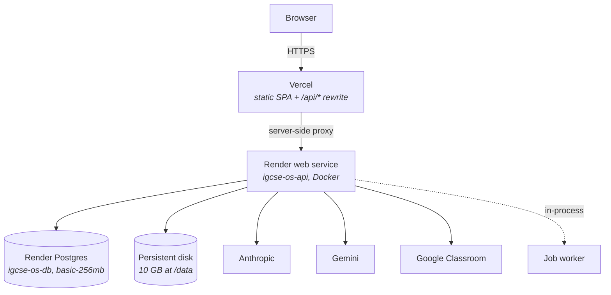

# 08. Infrastructure & Deployment

> **Volume 3 — Platform Engineering** · Engineering Constitution v1.0 · Status: Active
> **Owner:** Founder (see `governance/ownership.md`)
>
> Governs how MANARA is built, configured, and deployed, and the constraints production
> imposes on the code.

## Contents

- [Purpose](#purpose)
- [Scope](#scope)
- [Sources](#sources)
- [Principles](#principles)
- [Current Reality](#current-reality)
  - [Topology](#topology)
  - [The API service](#the-api-service)
  - [The frontend](#the-frontend)
  - [Local development](#local-development)
  - [Configuration reference](#configuration-reference)
  - [How work reaches production](#how-work-reaches-production)
  - [The single-instance constraint chain](#the-single-instance-constraint-chain)
- [Standards](#standards)
- [Known Gaps](#known-gaps)
- [Review Triggers](#review-triggers)

---

## Purpose

Answers *where does this run, how is it configured, and what does production impose on the
code*. Several of the codebase's most consequential constraints are deployment decisions
wearing application clothing: the single instance, the persistent disk, the same-origin proxy
that makes sessions refreshable, and the system-font stack.

## Scope

**In scope:** the two-service topology; `render.yaml`, `backend/Dockerfile`,
`frontend/vercel.json`, `docker-compose.yml`; the complete environment-variable reference; the
deploy and rollback process; the single-instance constraint chain.

**Out of scope:** what the CSP defends against (§07); reliability and health checking (§11);
step-by-step operational procedures (§14); performance budgets (§10).

### Non-goals

Global entries in `governance/non-goals.md`. Specific here:

- **No Kubernetes, no container orchestration.** One Render service, one Vercel project.
- **No staging environment today.** Vercel preview builds cover the frontend; there is no
  API staging. This is a gap, not a decision — see below.
- **No infrastructure-as-code beyond `render.yaml`.** No Terraform, no Pulumi.
- **No second frontend origin.** Render deliberately does not serve a copy of the frontend.
- **No blue/green or canary deploys.** Render replaces the revision.

## Sources

Written from: `render.yaml`; `backend/Dockerfile`; `frontend/vercel.json`;
`docker-compose.yml`; `backend/app/config.py`; `backend/.env.example`;
`backend/app/main.py`; `frontend/vite.config.ts`; `README.md`.

---

## Principles

**P1 — One deployable per concern, and no more.** An API on Render, a static site on Vercel.
Every additional moving part is paid for forever.

**P2 — The API is same-origin to the browser.** Vercel proxies `/api/*` server-side. This is
not a convenience: it is what makes a `SameSite=Lax` refresh cookie work, and therefore what
makes sessions survive.

**P3 — Configuration is environment-only.** No configuration file ships with the image, and
no secret is in the repository.

**P4 — A commit is not live until its deploy is confirmed green.** `main` is the source of
what should be running, not proof of what is.

**P5 — Degrade on missing configuration, never on startup.** An unset API key disables one
surface with a clear message. The app still starts.

---

## Current Reality

### Topology



**Render deliberately does not serve a second copy of the frontend.** The comment at the top
of `render.yaml` gives the reason: a second origin would not match `GOOGLE_REDIRECT_URI`, so
Classroom would silently fail for anyone who landed on it while everything else appeared to
work.

### The API service

`render.yaml` provisions one Postgres database (`igcse-os-db`, `plan: basic-256mb`) and one
Docker web service (`igcse-os-api`, `rootDir: backend`, `plan: starter`).

**The persistent disk** is `igcse-os-uploads`, 10 GB, mounted at `/data`, with
`UPLOAD_DIR=/data/uploads`. It exists because `services/storage.py` writes to the local
filesystem and the database stores only relative paths — without it, every deploy replaces the
container and silently orphans every file row. **A Render service with a disk runs a single
instance.**

`backend/Dockerfile` is 16 lines:

```dockerfile
FROM python:3.11-slim
WORKDIR /app
COPY pyproject.toml ./
COPY app ./app
COPY alembic ./alembic
COPY alembic.ini ./
COPY seed ./seed
RUN pip install --no-cache-dir .
EXPOSE 8000
CMD ["sh", "-c", "alembic upgrade head && uvicorn app.main:app --host 0.0.0.0 --port ${PORT:-8000}"]
```

Single-stage. **Runs as root. No lockfile** — dependencies resolve from the `>=` ranges in
`pyproject.toml` at build time, so two builds of the same commit can differ. **No
`.dockerignore`**, so the build context carries whatever is in `backend/`. **No `HEALTHCHECK`.**

**Migrations run at container start**, chained with `&&`. The consequence is the most important
operational fact in this document: **a failing migration means the service never starts.** It
does not degrade — it is down, and the previous revision keeps serving while `main` has already
moved.

`render.yaml` declares **no `healthCheckPath`**, so Render never calls `GET /api/v1/health` —
which is itself a static literal that checks nothing (§11).

### The frontend

Vercel, project root `frontend`, Vite auto-detected. `frontend/vercel.json` does three things:

1. **Rewrites `/api/(.*)`** to `https://igcse-os-api.onrender.com/api/$1` — a server-side
   proxy, so the browser sees one origin and the `SameSite=Lax` refresh cookie is sent.
2. **SPA fallback**: `/((?!api/).*)` → `/index.html`.
3. **Sets the app's security headers** — the strict CSP, `nosniff`, and
   `Referrer-Policy: strict-origin-when-cross-origin` — on every non-API path. This is the only
   place they are set now that Vercel is the sole frontend host.

`VITE_API_BASE_URL` is a build-time escape hatch for a deploy without the rewrite. **A build
using it cannot refresh sessions**: cross-origin means no `SameSite=Lax` cookie, so sessions
end at access-token expiry. It also requires the origin in `CORS_ORIGINS` and a `connect-src`
change in the CSP. Prefer the rewrite.

### Local development

`docker-compose.yml` starts **only Postgres** by default; the `backend` service is behind
`profiles: ["full"]`. Normal local development is `docker compose up -d db` plus `uvicorn` and
`npm run dev` on the host, with Vite proxying `/api` to `localhost:8000`.

The `full` profile has two configuration defects, both of which produce confusing symptoms:

- It passes `ANTHROPIC_API_KEY` but **not `GEMINI_API_KEY`**. Marking, extraction, and syllabus
  extraction default to Gemini, so the entire homework pipeline fails there while chat and
  reports work.
- It does not set `REFRESH_COOKIE_SECURE`, which **defaults to `true`**. Over plain-HTTP
  localhost the browser drops the refresh cookie, so sessions silently expire after 30 minutes
  with no error.

### Configuration reference

Every setting in `backend/app/config.py`. Env var names are the field names upper-cased.
"Prod" is how `render.yaml` supplies it.

**Core**

| Variable | Default | Prod | Failure mode if wrong |
|---|---|---|---|
| `DATABASE_URL` | local Postgres | `fromDatabase` | Service will not start. `postgres://` and `postgresql://` are auto-rewritten to `postgresql+asyncpg://` |
| `JWT_SECRET` | `change-me-in-production` | `generateValue` | A known signing key; also invalidates all sessions and all stored Google tokens when changed |
| `JWT_ALGORITHM` | `HS256` | default | — |
| `ACCESS_TOKEN_EXPIRE_MINUTES` | `30` | default | Longer weakens `ADR-0008`'s tradeoff (`SEC-5`) |
| `REFRESH_TOKEN_EXPIRE_DAYS` | `30` | default | — |
| `UPLOAD_DIR` | `uploads` | `/data/uploads` | **Not in `.env.example`.** Wrong value on Render orphans every file row |
| `CORS_ORIGINS` | `http://localhost:5173` | Vercel origin | Only matters for a cross-origin build; a missing origin fails in the browser with no server-side trace |
| `REFRESH_COOKIE_SECURE` | `true` | `"true"` | `true` over plain HTTP drops the cookie and sessions never refresh |

**AI providers**

| Variable | Default | Prod | Failure mode if wrong |
|---|---|---|---|
| `ANTHROPIC_API_KEY` | unset | `sync: false` | Chat, reports, readiness synthesis, class briefs report "not configured" |
| `ANTHROPIC_MODEL` | `claude-opus-4-8` | default | — |
| `GEMINI_API_KEY` | unset | `sync: false` | **The homework pipeline fails** — marking, extraction, syllabus all default to Gemini |
| `GEMINI_MODEL` | `gemini-2.5-pro` (**placeholder**) | `sync: false` | An owner-supplied value; the default is explicitly not a real commitment |
| `AI_MARKING_PROVIDER` / `_MODEL` | `gemini` / `""` | `gemini` | Restated in `render.yaml` so it can be flipped to `anthropic` from the dashboard with no code change |
| `AI_EXTRACTION_PROVIDER` / `_MODEL` | `gemini` / `""` | `gemini` | as above |
| `AI_SYLLABUS_PROVIDER` / `_MODEL` | `gemini` / `""` | `gemini` | as above |
| `AI_CHAT_PROVIDER` / `_MODEL` | `anthropic` / `claude-haiku-4-5` | default | Chat is the only streaming surface; a Gemini-routed chat **raises** |
| `AI_REPORTS_PROVIDER` / `_MODEL` | `anthropic` / `""` | default | — |
| `AI_READINESS_PROVIDER` / `_MODEL` | `anthropic` / `""` | default | — |
| `AI_CLASS_BRIEF_PROVIDER` / `_MODEL` | `anthropic` / `""` | default | — |
| `AI_MODEL_PRICING` | `"{}"` | `sync: false` | Empty means every call records `cost_usd = NULL` and reports as `unpriced_call_count` — never a fabricated `$0` |

**Readiness**

| Variable | Default | Prod | Failure mode if wrong |
|---|---|---|---|
| `READINESS_V2_SHADOW_ENABLED` | `true` | `"true"` | **A kill switch, not a shadow flag.** `false` stops v2 runs and silently carries the app on v1 |
| `READINESS_V2_COALESCE_SECONDS` | `600` | `"600"` | Lower multiplies AI spend on bursts; higher delays visible readiness |

**Google Classroom**

| Variable | Default | Prod | Failure mode if wrong |
|---|---|---|---|
| `GOOGLE_CLIENT_ID` / `GOOGLE_CLIENT_SECRET` | unset | `sync: false` | Feature reports "not configured"; app runs fine |
| `GOOGLE_REDIRECT_URI` | localhost callback | Vercel callback URL | **The full URL, origin and path.** Must be registered verbatim on the Google OAuth client or connect fails |
| `GOOGLE_TOKEN_ENCRYPTION_KEY` | unset → derived from `JWT_SECRET` | `generateValue` | Changing it makes every stored Google refresh token undecryptable; every tutor must reconnect |

**Frontend (build-time)**

| Variable | Default | Notes |
|---|---|---|
| `VITE_API_BASE_URL` | `""` (same-origin) | Setting it breaks session refresh — see above |

`.env.example` lists 29 keys and **omits `UPLOAD_DIR`**, which is documented in `config.py` and
set by `render.yaml` and by `tests/conftest.py`.

### How work reaches production

**`main` is the only branch anything deploys from.** Render and Vercel both build from it and
nothing else. It is the sole *source* of what the user is running, not a guarantee of what they
are running: a deploy can fail or lag, and a failed one leaves the previous revision serving
while `main` has already moved.

Pointing either service at another branch is what previously split the product across two
divergent histories. A service left on a stale branch keeps serving it silently, and the
symptoms — missing endpoints, migration revisions that "don't exist" — look like application
bugs rather than a deploy misconfiguration.

**Nothing is committed directly to `main`.** A merge ships immediately, with no further gate.
Every change branches off `main`, runs both suites locally, opens a pull request, and merges
once green and approved. The only exception is documentation-only changes — prose in
`README.md`, `CLAUDE.md`, or `docs/`. A code comment does not qualify, because it lives in a
file that ships.

### The single-instance constraint chain

Three independent things pin the API to one instance. They are listed in the order they must be
unwound, because each later item is cheap once the earlier one is done.

1. **The persistent disk.** `services/storage.py` writes to local disk; Render gives a
   disk-mounted service one instance. **Unwind:** move storage to object storage. Paths are
   already stored relative to `UPLOAD_DIR` precisely so this does not touch data.
2. **The in-process worker.** Started in `main.py`'s `lifespan`, so it scales with the API and
   dies with it. **Unwind:** move it to its own service. The claim query already uses
   `FOR UPDATE SKIP LOCKED`, so multiple workers are safe today.
3. **The in-process login limiter.** `services/rate_limit.py` is a process-global dict; with N
   instances the effective limit is 10N. **Unwind:** move the counter to Postgres or Redis.

Until all three are done, **scaling out is a correctness change, not a configuration change**.
See `RISK-1`.

---

## Standards

### Deployment

**`INF-1` — MUST · Critical · Active**
Render and Vercel build from the repository's default branch and no other. Changing a
connected branch on either dashboard is a production change requiring the same care as a
deploy.
*Rationale:* a service left on a stale branch serves it silently, and the symptoms look like
application bugs.

**`INF-2` — MUST · Critical · Active**
Nothing is committed directly to the default branch except documentation-only changes to
`README.md`, `CLAUDE.md`, or `docs/`. A code comment is not a documentation change.
*Rationale:* a merge ships immediately with no further gate; unverified work must not land on
it.

**`INF-3` — MUST · Critical · Active**
Treat a commit as live only once its deploy is confirmed green.
*Rationale:* `alembic upgrade head` failing mid-chain is a real outcome; the previous revision
keeps serving while `main` has moved.

**`INF-4` — MUST · Important · Active**
A change touching migrations, environment variables, or the start command states its rollback
in the pull request description.
*Rationale:* the rollback for a code change is a revert; for a migration or a configuration
change it is not, and the moment to work that out is not during an outage.

**`INF-5` — MUST NOT · Critical · Active**
Never deploy a second copy of the frontend on another origin.
*Rationale:* it would not match `GOOGLE_REDIRECT_URI`, so Classroom fails silently for anyone
who lands on it while everything else appears to work.

**`INF-6` — MUST · Critical · Active**
Keep the API same-origin to the browser via the `/api/*` rewrite.
*Rationale:* it is what makes the `SameSite=Lax` refresh cookie work; a cross-origin build
cannot refresh sessions at all (`ADR-0008`).

### Configuration

**`INF-7` — MUST · Critical · Active**
All configuration is environment-only, read through `get_settings()`. No secret is in the
repository.
*Rationale:* `SEC-24`; and `get_settings()` applies the `postgres://` rewrite that hosting
providers make necessary.

**`INF-8` — MUST · Important · Active**
A new setting is added to `config.py` with a typed default and a comment stating its failure
mode, **and** to `.env.example`, **and** to `render.yaml` when production needs a non-default
value.
*Rationale:* `UPLOAD_DIR` is documented in two of those three and missing from `.env.example`,
which is how a local environment silently differs from production.

**`INF-9` — MUST · Important · Active**
A missing optional credential degrades that surface to a clear "not configured" state. It never
prevents startup.
*Rationale:* P5, and it is what lets the app run without Google or without one AI provider.

**`INF-10` — MUST NOT · Important · Active**
Never hardcode a provider model identifier as a meaningful default. `GEMINI_MODEL`'s default is
a placeholder and is labelled as one.
*Rationale:* a model id is an account-specific, time-varying fact; a plausible-looking default
gets deployed unexamined.

**`INF-11` — MUST · Important · Active**
`REFRESH_COOKIE_SECURE` is `false` only for plain-HTTP local development.
*Rationale:* `true` over HTTP drops the cookie and sessions silently stop refreshing; `false`
in production sends a 30-day credential over plain HTTP.

### Build

**`INF-12` — SHOULD · Important · Active**
The image installs from a lockfile, runs as a non-root user, and ships a `.dockerignore`.
*Rationale:* reproducibility and least privilege; none of the three is true today (`RISK-11`,
`SEC-28`).

**`INF-13` — MUST · Critical · Active**
Migrations run before the API starts, and a migration failure stops startup rather than
serving against a half-migrated schema.
*Rationale:* the current `&&` chain does exactly this. Serving against a partially migrated
database is worse than being down, because it corrupts rather than pauses.

**`INF-14` — SHOULD · Important · Active**
The disk's usage is checked before any change expected to increase upload volume
significantly.
*Rationale:* 10 GB with no monitoring, holding every piece of student work ever submitted
(`RISK-8`).

### Environment parity

**`INF-15` — SHOULD · Important · Active**
`docker-compose.yml`'s `full` profile carries every variable the application needs to work
locally.
*Rationale:* it currently omits `GEMINI_API_KEY` (the homework pipeline fails) and
`REFRESH_COOKIE_SECURE` (sessions silently stop refreshing) — both presenting as application
bugs.

**`INF-16` — SHOULD · Important · Draft**
A change to migrations or the start command is verified against a real Postgres before merge.
*Rationale:* the test suite runs on SQLite and never executes migrations, so this class of
failure is currently found in production (`RISK-3`). **Draft** until a staging path or CI
service container exists.

---

## Known Gaps

| Gap | Why it matters | Severity |
|---|---|---|
| **No staging environment for the API.** Vercel previews cover the frontend; the backend has nothing. | A migration's first execution is in production, where failure means the service does not start. `RISK-3`. | `blocking` |
| **`render.yaml` declares no `healthCheckPath`.** | Render never calls the health endpoint, so a broken revision is not detected. Compounded by the endpoint checking nothing (§11). `RISK-4`. | `blocking` |
| **No lockfile, root user, no `.dockerignore`, no `HEALTHCHECK`.** | Non-reproducible builds and unnecessary privilege. `RISK-11`, `INF-12`. | `before scale` |
| **`docker-compose.yml`'s `full` profile omits `GEMINI_API_KEY` and `REFRESH_COOKIE_SECURE`.** | The homework pipeline fails and sessions stop refreshing, both presenting as application bugs. Breaks `INF-15`. | `before scale` |
| **`UPLOAD_DIR` is missing from `.env.example`** while documented in `config.py` and set in `render.yaml`. | Breaks `INF-8`; a developer's local storage path differs from production without knowing. | `nice to have` |
| **`main.py:80–81` states frontend security headers are set in `render.yaml`.** They moved to `frontend/vercel.json`. | A stale comment on a security-relevant subject, pointing at the wrong file. Fixing it is a code change. | `nice to have` |
| **No documented rollback procedure.** | §14 now provides one; until this document was written there was none. | `blocking` |
| **No backup or restore procedure for the uploads disk.** | The database confidently references files that a disk loss would destroy. `RISK-8`. | `before scale` |
| **Scaling out is a correctness change, not a configuration change.** | Three independent constraints break simultaneously. `RISK-1`; the unwind order is above. | `before scale` |

---

## Review Triggers

Update this document when:

- A setting is added, removed, or changes its default — the configuration reference must match
  `config.py` exactly.
- `render.yaml`, `backend/Dockerfile`, `frontend/vercel.json`, or `docker-compose.yml` changes.
- A service is added, or a connected branch changes on either dashboard.
- The persistent disk, its size, or its mount path changes.
- Storage moves to object storage, or the worker moves out of the API process — either
  advances the constraint chain.
- A staging environment is introduced.
- The deploy or rollback process changes.
