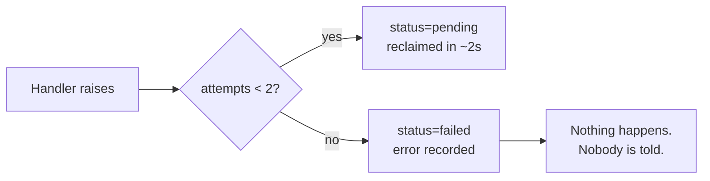

# 11. Reliability (SRE)

> **Volume 4 — Reliability & Operations** · Engineering Constitution v1.0 · Status: Active
> **Owner:** Founder (see `governance/ownership.md`)
>
> Governs what happens when things break: failure domains, degradation, health, observability,
> and the objectives the system is held to.

## Contents

- [Purpose](#purpose)
- [Scope](#scope)
- [Sources](#sources)
- [Principles](#principles)
- [Current Reality](#current-reality)
  - [Failure domains](#failure-domains)
  - [Degradation that already works](#degradation-that-already-works)
  - [Health checking](#health-checking)
  - [Job reliability](#job-reliability)
  - [Observability](#observability)
  - [Backup and recovery](#backup-and-recovery)
- [Standards](#standards)
- [Known Gaps](#known-gaps)
- [Review Triggers](#review-triggers)

---

## Purpose

MANARA degrades unusually well in some places and fails invisibly in others, and the
difference is not obvious from the code. This document maps what breaks, what it takes with
it, what the system already does correctly when a dependency fails, and the substantial gap
where the system cannot tell anyone that something has gone wrong.

## Scope

**In scope:** failure domains and blast radius; degradation behaviour; health checking; job
system reliability; logging, metrics, tracing, and error tracking; service objectives; backup
and recovery expectations.

**Out of scope:** the deployment topology itself (§08); the step-by-step response to each
failure (§14); performance budgets (§10); test coverage (§12).

### Non-goals

- **No high-availability target.** One instance, one region, one database. Planned downtime
  during a deploy is accepted.
- **No distributed tracing.** One process; a request id in structured logs is the
  proportionate answer.
- **No paging rotation.** One person, no formal on-call. The structure exists in
  `governance/ownership.md` so it can be added rather than invented under pressure.
- **No chaos engineering.**
- **No self-healing automation.** Recovery is a documented human procedure (§14).

## Sources

Written from: `backend/app/main.py`; `backend/app/workers/jobs.py`; `backend/app/db.py`;
`backend/app/services/storage.py`; `backend/app/services/ai.py`;
`backend/app/services/readiness_v2_ai.py`; `backend/app/api/chat.py`; `render.yaml`;
`docker-compose.yml`; `backend/app/models/`.

---

## Principles

**P1 — Preserve completed work.** When a dependency fails, keep what was already computed,
record the failure where the product can show it, and keep everything else running.

**P2 — A silent failure is worse than a loud one.** The system's most serious reliability
problem is not that things break; it is that some breakages are invisible to everyone
including the operator.

**P3 — Degrade per surface, not globally.** One provider outage removes some features. It does
not remove the product.

**P4 — Being down beats being wrong.** A half-migrated schema serving requests corrupts data;
a service that will not start pauses it.

**P5 — If it cannot be observed, it cannot be operated.** Every claim about reliability below
that has no measurement attached is recorded as a gap.

---

## Current Reality

### Failure domains

| Domain | Blast radius | Degradation | Detection today |
|---|---|---|---|
| **Postgres** | Everything | None. No graceful path exists | Request failures |
| **Uploads disk** | New uploads, file downloads, extraction and marking of unread files | None | Request failures |
| **The job worker** | All extraction, marking, readiness synthesis, reports, Classroom sync | None — **and the API keeps reporting healthy** | **None** |
| **Anthropic** | Chat, reports, readiness synthesis, class briefs | Clear "not configured"/error per surface; marking and extraction unaffected | Error persisted to a domain column |
| **Gemini** | Marking, extraction, syllabus extraction — the homework pipeline | Same; chat and reports unaffected | Error persisted to a domain column |
| **Google Classroom** | Import only | Direct upload unaffected by design | `sync_classroom` job failure |
| **Readiness v2 Layer 2** | Readiness freshness | Falls back per-subject to v1, response says `engine: "v1"` | Snapshot `status="failed"` |
| **Vercel** | The entire user-facing app | None — API is fine, nobody can reach it | External |
| **A migration** | The whole API: it never starts | None, by design (`P4`) | Deploy failure |

The AI split across two providers is a genuine resilience property, not a coincidence: no
single model provider outage stops the product. See `ADR-0006`.

### Degradation that already works

Four patterns are implemented and are the ones to copy:

1. **Missing credential → clear per-surface error.** `AIUnavailableError` and
   `GoogleClassroomUnavailableError` name the variable to set. The app still starts.
2. **Partial work is preserved.** If readiness Layer 2 fails, the already-computed
   `factor_evaluations` rows are kept and the snapshot is written with `status="failed"`.
   The evaluation is not lost and the failure is visible.
3. **Per-subject fallback.** A (student, subject) with no ready v2 snapshot falls back to v1
   and the response says so, so the app never shows a blank page mid-migration.
4. **Errors persist where the product can show them.** `Assignment.extraction_error`,
   `Submission.ai_error`, `Report.error`, `SyllabusUpload.error`, `ReadinessSnapshot.error`,
   `Job.error`. A tutor sees what failed rather than an empty state.

### Health checking

```python
@app.get("/api/v1/health")
async def health() -> dict:
    return {"status": "ok"}
```

That is the whole implementation, defined inline on the app rather than in a router. **It is a
static literal.** It does not touch the database, does not check the worker, and does not
report a version or build.

`render.yaml` declares **no `healthCheckPath`**, so Render never calls it. There is no
`/readyz`, no `/livez`, and no version endpoint. `docker-compose.yml` has a healthcheck for the
database only.

The combination is the system's sharpest reliability edge: **a process whose worker has died,
whose database is unreachable, or which is running a stale revision will answer `{"status":
"ok"}` to anything that asks.**

### Job reliability

The mechanism is described in §04. Its reliability properties:

- **Nothing is lost on restart.** Jobs are rows, written before they run.
- **At-least-once delivery**, which makes handler idempotency a correctness requirement
  (`BE-6`).
- **One retry** (`MAX_ATTEMPTS = 2`), **with no backoff** — a failed job returns to `pending`
  and is re-claimed on the next 2-second poll, so both attempts are spent within seconds. For
  a transient blip that is fine; for a provider rate limit it wastes the retry.
- **`worker_loop` survives handler errors.** It catches every exception except
  `CancelledError`, logs, and continues. The loop is genuinely robust; the process it lives in
  is the single point of failure.
- **A job that fails twice is terminal.** Status `failed`, error recorded, **no alert, no
  dead-letter queue, no metric, and no retry path except a manual re-enqueue.**



The user-visible symptom of `E` is homework that stays "processing" forever.

### Observability

This is the thinnest area of the system, and it is thin by omission rather than by decision.

**Logging.** There is **no logging configuration at all** — no `basicConfig`, no `dictConfig`,
no structured logging, no log-level setting, no uvicorn log config. Two loggers exist in the
entire application:

- `workers/jobs.py:21` — `logging.getLogger("jobs")`: worker started/stopped, job failure with
  a traceback, and an iteration crash.
- `api/chat.py:33` — `logging.getLogger(__name__)`: AI unavailable, and a streaming failure.

Everything else that fails is written to a database column and never logged. `alembic.ini` has
a logging section, but it applies only during migrations.

**Metrics.** None. No Prometheus, no OpenTelemetry, no StatsD, no timing middleware, no
`/metrics`.

The closest thing is `ai_usage_events`, which records tokens and cost per AI call — but that is
a product feature for allowances, not infrastructure telemetry.

**Error tracking.** None. No Sentry, no Rollbar. Unhandled exceptions produce FastAPI's default
500 and whatever uvicorn prints to stdout.

**Request identity.** None. No request-id middleware, no `X-Request-Id`, no correlation id in
logs, no `contextvars`. A user-reported error cannot be tied to a log line.

The one correlation identifier that exists is domain-level: `evaluation_run_id` links a
snapshot to the exact factor rows it was synthesized from. Similarly `ai_model` and
`ai_prompt_version` are stamped on produced records. **The system can explain its own numbers
far better than it can explain its own failures** — which is a fair reflection of what it was
built to do.

### Backup and recovery

**Database:** Render's managed Postgres provides its plan's backups. Nothing in the repository
documents the retention, the restore procedure, or when a restore was last tested.

**Uploads disk:** no documented backup. This is the sharper exposure — the database stores only
relative paths, so a disk loss leaves every row confidently referencing a file that no longer
exists, with no reconciliation tool. See `RISK-8`.

**Configuration:** `render.yaml` is in the repository; the `sync: false` secrets are only in
the Render dashboard. There is no documented inventory of what must be re-entered to rebuild
the service from scratch.

---

## Standards

### Degradation

**`REL-1` — MUST · Critical · Active**
A dependency failure degrades the surfaces that need it and leaves every other surface working.
It never prevents startup.
*Rationale:* P3 — one provider outage must not be an outage of the product.

**`REL-2` — MUST · Critical · Active**
Work already completed when a failure occurs is preserved, not discarded.
*Rationale:* P1. `compute_readiness_v2` keeping its factor rows and writing `status="failed"`
is the pattern; discarding them would waste the deterministic work and lose the audit trail.

**`REL-3` — MUST · Important · Active**
A failure the user will notice is persisted where the product can show it — a domain error
column — not only to `Job.error` or a log.
*Rationale:* `BE-11`. An empty state with no explanation is indistinguishable from "nothing to
do".

**`REL-4` — MUST · Critical · Active**
A schema change that has not completed prevents the service from serving, rather than serving
against a half-migrated database.
*Rationale:* P4. The `alembic upgrade head && uvicorn` chain already does this; do not
decouple them to "improve availability".

### Health and readiness

**`REL-5` — MUST · Critical · Draft**
The health endpoint verifies the dependencies whose failure it is meant to detect: at minimum
a database round-trip, and the worker's liveness. It reports the running revision.
*Rationale:* a static `{"status": "ok"}` reports health for a process that cannot reach its
database. **Draft** until implemented — it is a code change.

**`REL-6` — MUST · Critical · Draft**
`render.yaml` declares `healthCheckPath` so the platform actually calls the health endpoint.
*Rationale:* an unchecked health endpoint detects nothing. **Draft** — pairs with `REL-5`;
pointing a platform check at an endpoint that always returns `ok` would be worse than none.

**`REL-7` — MUST · Important · Active**
Liveness and readiness are distinguished: liveness answers "should this process be restarted",
readiness answers "should traffic be sent here".
*Rationale:* conflating them means a transient dependency failure triggers restarts that cannot
help.

### The job system

**`REL-8` — MUST · Critical · Active**
Every handler is idempotent, because delivery is at-least-once.
*Rationale:* `BE-6`; stated here because it is a reliability property before it is a coding
one — retry is the recovery mechanism, and a non-idempotent handler makes retry unsafe.

**`REL-9` — SHOULD · Important · Draft**
A retry is delayed with exponential backoff by setting `run_after`, rather than being
re-claimed on the next poll.
*Rationale:* both attempts are currently spent within ~2 seconds, so a rate limit or a brief
outage exhausts the retry budget without benefiting from it. **Draft** — `run_after` already
exists; only the retry path needs to use it.

**`REL-10` — MUST · Critical · Draft**
A terminally failed job is surfaced: counted, alertable, and visible to an operator without a
database query.
*Rationale:* today a failed job is silent and the user-visible symptom is work that never
completes. **Draft** — needs somewhere for an alert to go.

**`REL-11` — MUST · Important · Active**
A handler bounds its own work. Unbounded iteration over rows or model calls is not permitted in
a job.
*Rationale:* jobs are strictly serial on one worker, so one unbounded handler is an outage of
every asynchronous surface (`PERF-11`).

### Observability

**`REL-12` — MUST · Critical · Draft**
The application configures logging explicitly, emits structured records, and logs at least:
service start and stop, unhandled exceptions, job lifecycle transitions, authentication and
authorization failures, and external-call failures.
*Rationale:* two ad-hoc loggers and no configuration means most failures leave no trace at all.
**Draft** — the required change is a logging configuration plus call sites.

**`REL-13` — MUST · Critical · Draft**
Every request carries a correlation id — accepted from `X-Request-Id` or generated — included
in every log record for that request and returned in the response.
*Rationale:* without it a user-reported error cannot be tied to anything. Pairs with `API-*`
error handling.

**`REL-14` — MUST NOT · Critical · Active**
Never log a secret, a token, a password, or C2 personal data.
*Rationale:* `SEC-25`. Logs are read by more systems and people than the database is.

**`REL-15` — SHOULD · Important · Draft**
Unhandled exceptions are reported to an error-tracking service with enough context to
reproduce, and without violating `REL-14`.
*Rationale:* stdout on a single container is not an error-tracking strategy.

**`REL-16` — SHOULD · Important · Draft**
The system exposes, at minimum: request rate and error rate by endpoint, latency percentiles,
job queue depth and age, failed-job count, and AI call rate and failure rate.
*Rationale:* these are the signals the objectives below are stated in; without them the
objectives are unmeasurable.

### Objectives

**`REL-17` — SHOULD · Recommended · Active**
Service level objectives, stated as targets to begin measuring against rather than as measured
baselines:

| Indicator | Objective |
|---|---|
| API availability (non-5xx on health-relevant paths) | 99.5% monthly |
| Successful marking of a submitted piece of work | 99% within 10 minutes |
| Readiness freshness after settling evidence | 99% within one debounce window plus 5 minutes |
| Data durability — a finalized mark, once written | 100%. No acceptable loss rate |
| Planned deploy downtime | Accepted; single instance, no blue/green |

*Rationale:* P5 — none of these is measured today, and they are stated so the first measurement
has something to disagree with. Durability is the one that is not a target but a requirement:
a lost finalized mark is a lost piece of a child's academic record.

**`REL-18` — MUST · Important · Active**
A change that weakens a stated objective is called out explicitly in its pull request.
*Rationale:* nothing measures automatically, so review is the only checkpoint.

### Recovery

**`REL-19` — MUST · Critical · Draft**
The database restore procedure is documented and has been executed at least once against a
non-production target.
*Rationale:* an untested backup is a hypothesis. §14 documents the procedure; **Draft** until
it has actually been run.

**`REL-20` — MUST · Critical · Draft**
Uploaded files are backed up, and a tool exists to reconcile stored rows against stored files.
*Rationale:* the database references files by relative path with no integrity link; a disk loss
destroys every submission while the rows still confidently point at them (`RISK-8`).

**`REL-21` — MUST · Important · Active**
Every configuration value required to rebuild the service is either in `render.yaml` or listed
in §08's configuration reference.
*Rationale:* `sync: false` secrets exist only in a dashboard; rebuilding from scratch requires
knowing the complete list.

---

## Known Gaps

| Gap | Why it matters | Severity |
|---|---|---|
| **The health check verifies nothing and nothing calls it.** A static literal, and `render.yaml` sets no `healthCheckPath`. | A process with a dead worker or an unreachable database reports healthy. `RISK-4`. Blocks `REL-5`, `REL-6`. | `blocking` |
| **A dead worker is invisible.** It shares the API process; if it dies the API keeps serving and reporting healthy while every asynchronous surface stops. | The largest silent-failure surface in the system. User-visible symptom: work that stays "processing" forever. `RISK-4`. | `blocking` |
| **A terminally failed job is silent.** No alert, no dead-letter queue, no metric, no retry path except manual re-enqueue. | Marking simply stops for that submission and nobody is told. Blocks `REL-10`. | `blocking` |
| **No logging configuration and only two loggers.** Most failures leave no trace outside a database column. | Blocks `REL-12`. An incident could not be reconstructed. | `blocking` |
| **No request ids.** | A user-reported error cannot be tied to a log line. Blocks `REL-13`. | `blocking` |
| **No metrics and no error tracking.** | Every objective in `REL-17` is unmeasurable, and unhandled exceptions go to stdout on one container. | `blocking` |
| **Job retries have no backoff.** Both attempts are spent within ~2 seconds. | Wastes the retry budget on exactly the failures retrying would fix. Blocks `REL-9`. | `before scale` |
| **No documented or tested database restore.** | An untested backup is a hypothesis. §14 has the procedure; it has not been executed. Blocks `REL-19`. | `blocking` |
| **No backup for the uploads disk and no row/file reconciliation.** | A disk loss destroys every submission while the database still references them. `RISK-8`. Blocks `REL-20`. | `blocking` |
| **No on-call or escalation path.** | Nothing defines who responds out of hours. See `governance/ownership.md`. | `before scale` |
| **Single instance, single region, single database.** | Any deploy is downtime; any instance loss is an outage. Deliberate today; §08 has the unwind order. `RISK-1`. | `before scale` |

This document has more `blocking` gaps than any other in the constitution. That is an accurate
picture: MANARA is built to explain its own numbers and is not yet built to explain its own
failures.

---

## Review Triggers

Update this document when:

- The health endpoint changes, or `healthCheckPath` is configured.
- Logging, metrics, request ids, or error tracking are introduced — most of this document's
  Draft rules become Active together.
- The worker moves out of the API process, which changes the top three failure rows.
- The job retry policy or failure handling changes.
- A backup or restore procedure is executed or documented.
- An incident occurs — record the failure domain it revealed, or why an existing row did not
  predict it.
- An objective in `REL-17` gains a real measurement.
